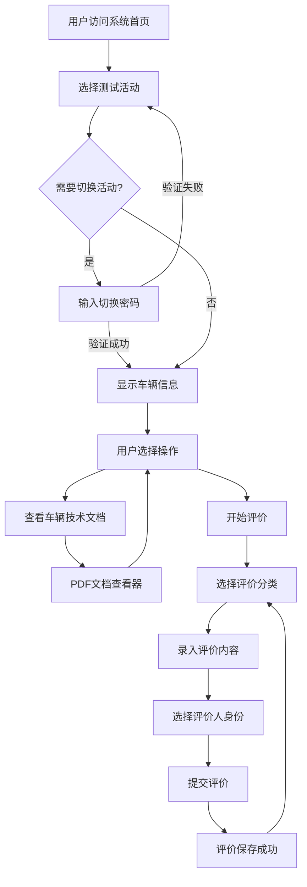
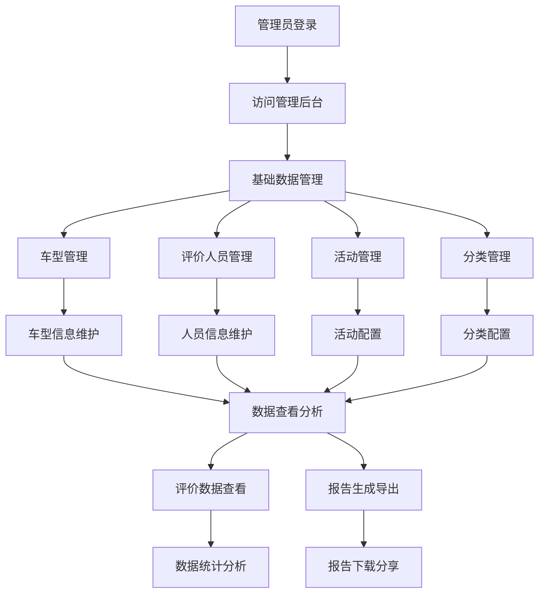
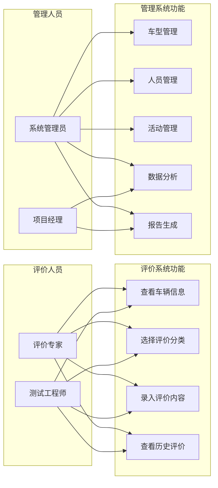

# 试车反馈评价系统需求规格说明书

**文档版本：** 1.0  
**编写日期：** 2025年7月23日  
**编写人员：** 系统架构师  
**审核人员：** 项目经理  

## 1. 引言

### 1.1 编写目的
本文档详细描述了试车反馈评价系统的功能需求、非功能需求、约束条件和验收标准，为系统设计、开发、测试和验收提供依据。

### 1.2 项目背景
随着汽车行业试驾体验的重要性日益提升，需要一套专业的试车反馈评价系统来收集、管理和分析试驾人员的评价数据，为车辆改进和用户体验优化提供数据支撑。

### 1.3 定义与缩写
- **SRS**: Software Requirements Specification (软件需求规格说明书)
- **UI**: User Interface (用户界面)
- **API**: Application Programming Interface (应用程序接口)
- **CRUD**: Create, Read, Update, Delete (增删改查)
- **PDF**: Portable Document Format (便携式文档格式)

### 1.4 参考资料
- 项目立项书
- 用户调研报告
- 系统原型设计

## 2. 项目概述

### 2.1 产品概述
试车反馈评价系统是一个基于Web的评价管理平台，主要用于汽车试驾过程中收集专业评价人员的反馈意见，支持多维度评价、实时数据统计和报告生成。

### 2.2 产品定位
- **目标用户**: 汽车厂商、试驾中心、评价专家
- **应用场景**: 新车试驾评价、车型对比测试、产品改进反馈
- **核心价值**: 标准化评价流程、数据化反馈管理、专业化报告输出

### 2.3 产品特色
- 无缝iPad适配的移动端体验
- 专业的多维度评价体系
- 实时的数据统计和可视化
- 标准化的评价报告生成

## 3. 功能需求

### 3.1 平板端评价系统

#### 3.1.1 首页功能（FR-001）
**功能描述**: 系统入口页面，提供活动选择和车辆信息展示功能。

**详细需求**:
- **FR-001-01**: 活动选择器
  - 显示当前可用的测试活动列表
  - 支持活动切换，切换时需要密码验证
  - 显示活动关联的车辆信息

- **FR-001-02**: 车辆信息展示
  - 显示车辆基本信息（名称、型号）
  - 提供车辆技术文档查看入口
  - 显示车辆对应的评价分类

- **FR-001-03**: 导航功能
  - 提供"查看车辆信息"按钮
  - 提供"开始评价"按钮
  - 支持中英文语言切换

- **FR-001-04**: 界面设计
  - 采用glassmorphism设计风格
  - 支持iPad横屏和竖屏显示
  - 背景使用建筑物图片营造专业氛围

#### 3.1.2 车辆信息查看（FR-002）
**功能描述**: 提供车辆技术文档的在线查看功能。

**详细需求**:
- **FR-002-01**: PDF文档查看
  - 支持在线预览车辆技术文档
  - 提供文档下载功能
  - 支持文档缩放和页面导航

- **FR-002-02**: 文档管理
  - 每个车型关联一个技术文档
  - 支持多种文档格式（主要PDF）
  - 文档加载失败时提供友好提示

#### 3.1.3 评价分类选择（FR-003）
**功能描述**: 展示评价分类，支持用户选择要评价的维度。

**详细需求**:
- **FR-003-01**: 分类展示
  - 网格布局展示7个评价分类
  - 每个分类显示专业图标和名称
  - 支持中英文分类名称显示

- **FR-003-02**: 评价统计
  - 实时显示每个分类的评价数量
  - 用徽章形式显示在分类卡片右上角
  - 点击数量可查看该分类的历史评价

- **FR-003-03**: 交互功能
  - 点击分类进入具体评价页面
  - 提供返回首页功能
  - 支持查看已有评价详情

- **FR-003-04**: 评价分类定义
  - 动力总成：发动机、变速器、电机等
  - 底盘：悬挂、制动、转向等
  - 内饰：座椅、仪表、操控等
  - 外饰：造型、灯光、空气动力学等
  - 声学：NVH、音响、噪音等
  - 电子电器：车机、辅助系统等
  - 其它：综合评价和特殊项目

#### 3.1.4 评价录入功能（FR-004）
**功能描述**: 核心评价功能，支持专业评价人员录入详细的评价内容。

**详细需求**:
- **FR-004-01**: 评分系统
  - 1-10分评分制度
  - 分数区间颜色区分（1-3红色，4-6黄色，7-10绿色）
  - 支持点击选择和键盘输入评分

- **FR-004-02**: 评价内容编辑
  - 富文本编辑器支持
  - 基本格式化功能（粗体、斜体、下划线）
  - 列表和对齐功能
  - 时间标记功能，可插入当前时间戳

- **FR-004-03**: 评价人身份
  - 下拉选择评价人身份
  - 评价人列表从后台管理系统维护
  - 支持多个评价人对同一项目的独立评价

- **FR-004-04**: 数据保存
  - 实时保存草稿功能
  - 提交评价确认机制
  - 网络异常时的本地缓存

- **FR-004-05**: 界面功能
  - 侧边栏提供时间标记快捷操作
  - 返回上级页面功能
  - 评价提交成功后的反馈提示

### 3.2 后台管理系统

#### 3.2.1 用户认证管理（FR-005）
**功能描述**: 管理员用户的登录认证和会话管理。

**详细需求**:
- **FR-005-01**: 登录功能
  - 用户名和密码登录
  - 登录状态保持和超时管理
  - 登录失败重试限制

- **FR-005-02**: 会话管理
  - 基于Flask-Login的会话管理
  - 自动登出机制
  - 多设备登录限制

- **FR-005-03**: 密码安全
  - 密码哈希存储
  - 密码复杂度要求
  - 密码修改功能

#### 3.2.2 车型管理（FR-006）
**功能描述**: 管理测试车辆的基本信息和技术文档。

**详细需求**:
- **FR-006-01**: 车型信息管理
  - 车型名称、型号录入
  - 车型图片上传和管理
  - 车型状态管理（启用/禁用）

- **FR-006-02**: 技术文档管理
  - PDF文档上传功能
  - 文档版本管理
  - 文档预览和下载

- **FR-006-03**: CRUD操作
  - 新增车型信息
  - 编辑车型详情
  - 删除车型（级联处理关联数据）
  - 车型列表查询和筛选

#### 3.2.3 评价人员管理（FR-007）
**功能描述**: 管理参与评价的专业人员信息。

**详细需求**:
- **FR-007-01**: 人员信息管理
  - 姓名、部门、职务信息
  - 专业领域标签
  - 联系方式管理

- **FR-007-02**: 权限管理
  - 评价人员角色定义
  - 评价范围限制
  - 数据访问权限控制

- **FR-007-03**: CRUD操作
  - 批量导入评价人员
  - 人员信息维护
  - 人员状态管理

#### 3.2.4 测试活动管理（FR-008）
**功能描述**: 管理试驾测试活动的组织和配置。

**详细需求**:
- **FR-008-01**: 活动基本信息
  - 活动名称、日期、地点
  - 活动描述和目标
  - 活动状态管理

- **FR-008-02**: 活动配置
  - 关联测试车辆
  - 分配评价人员
  - 设置评价分类

- **FR-008-03**: 活动执行
  - 活动启动和结束
  - 进度监控和统计
  - 异常情况处理

#### 3.2.5 评价分类管理（FR-009）
**功能描述**: 管理评价维度和分类体系。

**详细需求**:
- **FR-009-01**: 分类定义
  - 分类名称（中英文）
  - 分类图标和颜色
  - 分类排序权重

- **FR-009-02**: 分类配置
  - 启用/禁用分类
  - 分类适用范围
  - 自定义分类添加

- **FR-009-03**: 分类管理
  - 分类层级结构
  - 分类关联规则
  - 分类使用统计

#### 3.2.6 评价数据管理（FR-010）
**功能描述**: 查看、统计和分析评价数据。

**详细需求**:
- **FR-010-01**: 数据查看
  - 按活动查看评价列表
  - 按车型统计评价分布
  - 按评价人查看历史记录

- **FR-010-02**: 数据统计
  - 评分统计和趋势分析
  - 分类评价完成度统计
  - 评价人员参与度统计

- **FR-010-03**: 数据筛选
  - 多维度筛选条件
  - 时间范围筛选
  - 关键词搜索

#### 3.2.7 报告生成（FR-011）
**功能描述**: 自动生成标准化的评价报告。

**详细需求**:
- **FR-011-01**: Word报告生成
  - 基于模板的报告生成
  - 包含评价统计和详细内容
  - 支持图表和表格

- **FR-011-02**: 报告内容
  - 活动基本信息
  - 车辆信息汇总
  - 各分类评价统计
  - 详细评价内容
  - 评分趋势分析

- **FR-011-03**: 报告导出
  - Word格式导出
  - PDF格式导出
  - 报告下载和分享

### 3.3 系统集成需求

#### 3.3.1 API接口（FR-012）
**功能描述**: 提供标准化的API接口支持前后端交互。

**详细需求**:
- **FR-012-01**: RESTful API设计
  - 标准HTTP方法支持
  - JSON数据格式
  - 统一错误处理

- **FR-012-02**: 核心接口
  - 活动数据接口
  - 评价数据接口
  - 统计数据接口
  - 文件上传接口

- **FR-012-03**: 接口安全
  - 接口访问认证
  - 数据传输加密
  - 接口调用限制

#### 3.3.2 多语言支持（FR-013）
**功能描述**: 支持中英文双语界面切换。

**详细需求**:
- **FR-013-01**: 界面语言切换
  - 实时语言切换
  - 语言偏好保存
  - 默认语言设置

- **FR-013-02**: 内容本地化
  - 界面文本翻译
  - 错误信息本地化
  - 日期时间格式本地化

- **FR-013-03**: 数据多语言
  - 分类名称双语支持
  - 报告模板多语言
  - 导出内容本地化

## 4. 非功能需求

### 4.1 性能需求（NFR-001）

- **NFR-001-01**: 响应时间
  - 页面加载时间 ≤ 3秒
  - API接口响应时间 ≤ 1秒
  - 文件上传响应时间 ≤ 5秒

- **NFR-001-02**: 并发处理
  - 支持同时50个用户在线评价
  - 数据库并发读写支持
  - 文件并发上传处理

- **NFR-001-03**: 数据处理
  - 单个评价内容 ≤ 10MB
  - 评价数据查询 ≤ 2秒
  - 报告生成时间 ≤ 30秒

### 4.2 可用性需求（NFR-002）

- **NFR-002-01**: 系统可用性
  - 系统正常运行时间 ≥ 99%
  - 故障恢复时间 ≤ 1小时
  - 数据备份和恢复机制

- **NFR-002-02**: 用户体验
  - 界面操作简单直观
  - 错误提示友好明确
  - 操作响应及时

- **NFR-002-03**: 设备兼容
  - iPad Safari浏览器优化
  - Chrome、Firefox浏览器支持
  - 响应式设计适配

### 4.3 安全性需求（NFR-003）

- **NFR-003-01**: 数据安全
  - 用户密码哈希存储
  - 评价数据加密传输
  - 敏感信息脱敏显示

- **NFR-003-02**: 访问控制
  - 基于角色的权限控制
  - 管理功能登录保护
  - 会话超时自动登出

- **NFR-003-03**: 系统安全
  - SQL注入防护
  - XSS攻击防护
  - CSRF攻击防护

### 4.4 可维护性需求（NFR-004）

- **NFR-004-01**: 代码质量
  - 模块化设计
  - 代码注释完整
  - 遵循编码规范

- **NFR-004-02**: 系统监控
  - 错误日志记录
  - 性能监控指标
  - 系统健康检查

- **NFR-004-03**: 部署维护
  - 配置外部化
  - 数据库迁移支持
  - 版本升级机制

### 4.5 可扩展性需求（NFR-005）

- **NFR-005-01**: 功能扩展
  - 评价分类可配置
  - 报告模板可定制
  - 新功能模块可插拔

- **NFR-005-02**: 数据扩展
  - 大数据量支持
  - 历史数据归档
  - 数据迁移能力

- **NFR-005-03**: 系统扩展
  - 微服务架构准备
  - 第三方系统集成
  - 云部署支持

## 5. 用户角色和权限

### 5.1 角色定义

#### 5.1.1 评价人员（普通用户）
**角色描述**: 参与试驾评价的专业人员，无需登录认证。

**权限列表**:
- ✅ 查看活动和车辆信息
- ✅ 查看车辆技术文档
- ✅ 选择评价分类
- ✅ 录入评价内容和评分
- ✅ 查看历史评价记录
- ✅ 切换界面语言
- ❌ 修改其他人的评价
- ❌ 删除评价数据
- ❌ 访问管理功能

#### 5.1.2 系统管理员
**角色描述**: 系统的管理和维护人员，拥有完整的管理权限。

**权限列表**:
- ✅ 完整的后台管理访问权限
- ✅ 车型信息CRUD操作
- ✅ 评价人员CRUD操作
- ✅ 测试活动CRUD操作
- ✅ 评价分类CRUD操作
- ✅ 查看所有评价数据
- ✅ 生成和导出评价报告
- ✅ 系统配置和参数设置
- ✅ 用户账号管理
- ✅ 系统日志查看

### 5.2 权限控制机制

#### 5.2.1 认证机制
- **前端评价系统**: 无需认证，直接访问
- **后台管理系统**: 基于用户名密码的认证
- **会话管理**: Flask-Login提供会话保持
- **自动登出**: 超时或异常情况自动退出登录

#### 5.2.2 授权机制
- **装饰器保护**: @login_required保护管理员路由
- **页面级权限**: 未登录用户无法访问管理页面
- **功能级权限**: 管理员可以执行所有CRUD操作
- **数据级权限**: 普通用户只能查看，管理员可以修改

#### 5.2.3 安全措施
- **密码安全**: Werkzeug哈希加密存储
- **会话安全**: 会话令牌和CSRF保护
- **传输安全**: HTTPS加密数据传输
- **访问日志**: 记录关键操作的访问日志

## 6. 业务流程

### 6.1 评价业务流程

### 6.2 管理业务流程

### 6.3 用例图

## 7. 约束条件

### 7.1 技术约束

- **开发平台**: Python 3.11+
- **Web框架**: Flask 2.3+
- **数据库**: SQLite（开发和小规模部署）
- **前端技术**: HTML5 + CSS3 + JavaScript + jQuery
- **部署环境**: Linux服务器
- **浏览器支持**: 现代浏览器，重点优化iPad Safari

### 7.2 性能约束

- **并发用户**: 最大50个同时在线用户
- **数据存储**: 单个数据库文件不超过2GB
- **文件大小**: 单个PDF文件不超过50MB
- **评价内容**: 单次评价内容不超过10MB

### 7.3 运行环境约束

- **操作系统**: Linux (Ubuntu 20.04+)
- **Python版本**: 3.11+
- **内存要求**: 最低2GB，推荐4GB
- **存储空间**: 最低10GB，推荐50GB
- **网络环境**: 内网部署，支持HTTPS

### 7.4 法规约束

- **数据保护**: 遵循数据保护相关法规
- **知识产权**: 不使用有版权争议的第三方组件
- **安全标准**: 符合企业信息安全要求

## 8. 验收标准

### 8.1 功能验收标准

#### 8.1.1 评价功能验收
- ✅ 用户可以正常选择活动和车辆
- ✅ 所有评价分类正常显示和可选择
- ✅ 评分系统准确记录1-10分评价
- ✅ 富文本编辑器功能完整可用
- ✅ 评价数据准确保存和显示
- ✅ 历史评价查看功能正常

#### 8.1.2 管理功能验收
- ✅ 管理员登录认证正常
- ✅ 所有CRUD操作功能完整
- ✅ 数据统计和查看功能准确
- ✅ 报告生成和导出功能正常
- ✅ 文件上传和管理功能稳定

#### 8.1.3 系统功能验收
- ✅ 中英文语言切换正常
- ✅ 响应式设计在iPad上显示正常
- ✅ 错误处理和用户提示友好
- ✅ 数据备份和恢复功能可用

### 8.2 性能验收标准

- ✅ 页面加载时间 ≤ 3秒
- ✅ API响应时间 ≤ 1秒
- ✅ 支持50个并发用户无性能问题
- ✅ 报告生成时间 ≤ 30秒
- ✅ 系统7×24小时稳定运行

### 8.3 安全验收标准

- ✅ 管理员密码哈希存储
- ✅ 未授权访问被正确拦截
- ✅ 数据传输过程加密
- ✅ 会话管理安全可靠
- ✅ 基本的安全攻击防护有效

### 8.4 用户体验验收标准

- ✅ 界面设计美观专业
- ✅ 操作流程简单直观
- ✅ 错误提示清晰明确
- ✅ iPad设备使用体验流畅
- ✅ 响应速度满足用户预期

## 9. 风险分析

### 9.1 技术风险

**风险1**: SQLite数据库性能瓶颈
- **概率**: 中等
- **影响**: 高
- **应对措施**: 数据库优化，考虑升级到PostgreSQL

**风险2**: 富文本编辑器兼容性问题
- **概率**: 低
- **影响**: 中等
- **应对措施**: 充分测试，准备备选方案

**风险3**: PDF文件处理性能问题
- **概率**: 中等
- **影响**: 中等
- **应对措施**: 文件大小限制，异步处理

### 9.2 业务风险

**风险1**: 用户需求变更
- **概率**: 高
- **影响**: 中等
- **应对措施**: 敏捷开发，快速迭代

**风险2**: 评价标准不统一
- **概率**: 中等
- **影响**: 高
- **应对措施**: 详细的用户培训和操作手册

### 9.3 项目风险

**风险1**: 开发进度延期
- **概率**: 中等
- **影响**: 高
- **应对措施**: 合理的项目计划，充足的缓冲时间

**风险2**: 人员流动影响
- **概率**: 低
- **影响**: 高
- **应对措施**: 完善的文档和知识转移

## 10. 附录

### 10.1 术语表

| 术语 | 定义 |
|------|------|
| 试车 | 对汽车进行实际驾驶测试的过程 |
| 评价分类 | 将汽车评价按照不同维度进行分类的体系 |
| 富文本编辑 | 支持格式化文本编辑的编辑器 |
| glassmorphism | 玻璃拟态设计风格，具有透明和模糊效果 |
| CRUD | 增加(Create)、读取(Read)、更新(Update)、删除(Delete)操作 |

### 10.2 参考文档

- Flask官方文档
- SQLAlchemy文档
- jQuery API文档
- HTML5/CSS3标准规范
- 软件工程标准规范

---
**文档状态**: ✅ 已完成  
**最后更新**: 2025年7月23日  
**版本号**: 1.0