# 试车反馈评价系统架构设计文档

**文档版本：** 1.0  
**编写日期：** 2025年7月23日  
**编写人员：** 系统架构师  
**审核人员：** 技术总监  

## 1. 引言

### 1.1 编写目的
本文档描述了试车反馈评价系统的整体架构设计，包括技术架构、系统模块划分、部署架构和技术选型等，为系统开发和部署提供架构指导。

### 1.2 文档范围
- 整体技术架构设计
- 系统模块和组件设计
- 数据流和接口设计
- 部署架构和环境配置
- 技术选型分析和说明

### 1.3 参考文档
- 需求规格说明书
- Flask框架最佳实践
- 软件架构设计模式

## 2. 架构概述

### 2.1 架构目标

#### 2.1.1 设计原则
- **简洁性**: 采用简单可靠的技术栈，降低维护成本
- **可扩展性**: 模块化设计，支持功能扩展和性能扩展
- **可维护性**: 清晰的代码结构，完善的文档和日志
- **安全性**: 多层次的安全防护，保护数据和系统安全
- **用户体验**: 响应式设计，优化移动端体验

#### 2.1.2 质量属性
- **性能**: 支持50并发用户，响应时间≤3秒
- **可用性**: 系统可用性≥99%，故障恢复时间≤1小时
- **安全性**: 数据加密传输，权限控制完善
- **可扩展性**: 支持功能模块扩展和数据量增长
- **兼容性**: 跨浏览器兼容，重点优化iPad体验

### 2.2 架构风格

本系统采用**经典三层架构**结合**MVC模式**的架构风格：

- **表现层**: 基于HTML/CSS/JavaScript的Web前端
- **业务逻辑层**: 基于Flask的业务处理逻辑
- **数据访问层**: 基于SQLAlchemy ORM的数据访问

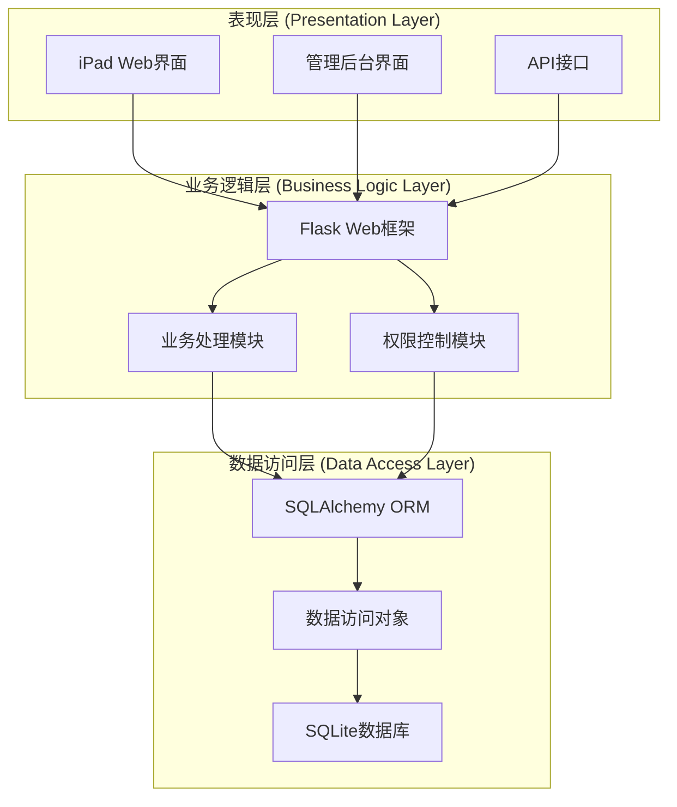

## 3. 整体技术架构

### 3.1 系统架构图

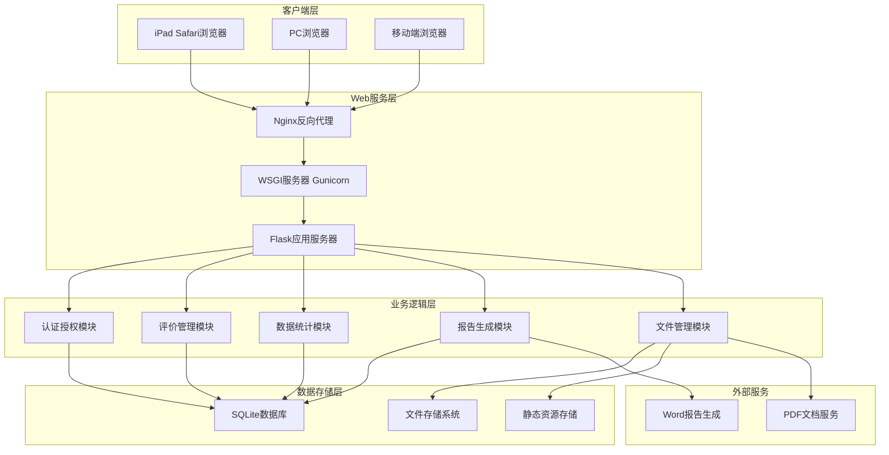

### 3.2 技术栈架构

#### 3.2.1 后端技术栈

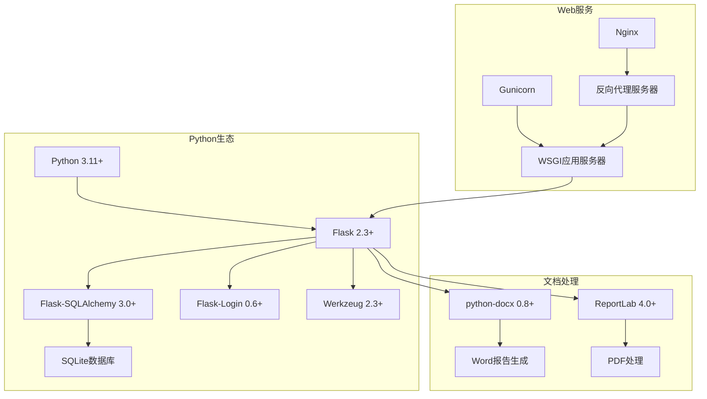

#### 3.2.2 前端技术栈

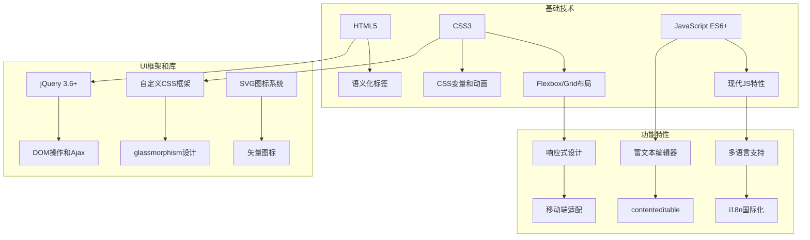

### 3.3 数据流架构

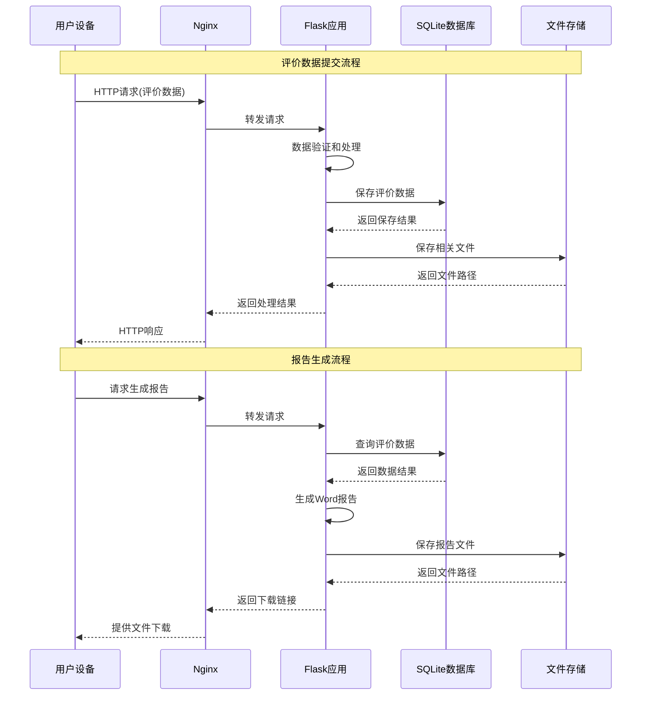

## 4. 系统模块设计

### 4.1 模块划分

#### 4.1.1 核心业务模块

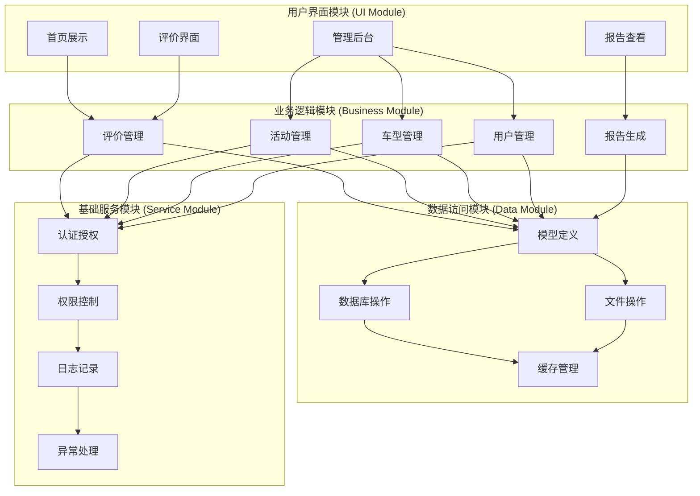

#### 4.1.2 模块详细说明

**1. 用户界面模块 (UI Module)**
- **首页展示**: 活动选择、车辆信息展示、导航功能
- **评价界面**: 分类选择、评价录入、历史查看
- **管理后台**: 数据管理、统计分析、系统配置
- **报告查看**: 报告生成、下载、预览

**2. 业务逻辑模块 (Business Module)**
- **评价管理**: 评价CRUD、评分统计、内容管理
- **活动管理**: 活动配置、人员分配、状态管理
- **车型管理**: 车型信息、文档管理、关联配置
- **用户管理**: 用户认证、权限分配、会话管理
- **报告生成**: 模板管理、数据聚合、文档输出

**3. 数据访问模块 (Data Module)**
- **模型定义**: SQLAlchemy模型、关系定义
- **数据库操作**: CRUD操作、查询优化、事务管理
- **文件操作**: 文件上传、存储、访问管理
- **缓存管理**: 数据缓存、会话缓存、静态资源缓存

**4. 基础服务模块 (Service Module)**
- **认证授权**: 用户登录、会话管理、令牌验证
- **权限控制**: 角色权限、访问控制、资源保护
- **日志记录**: 操作日志、错误日志、访问日志
- **异常处理**: 错误捕获、异常转换、用户提示

### 4.2 组件关系图

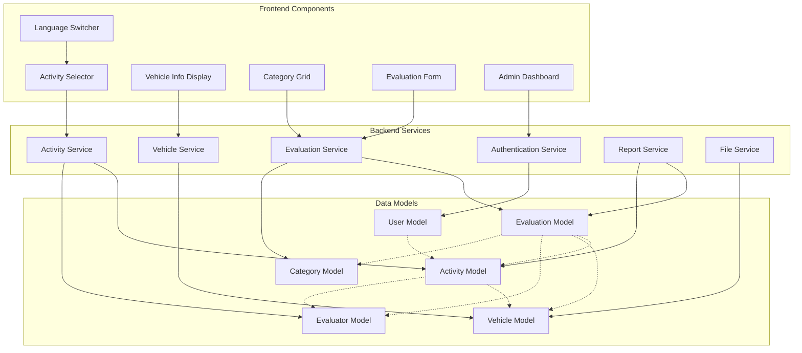

### 4.3 接口设计

#### 4.3.1 RESTful API设计

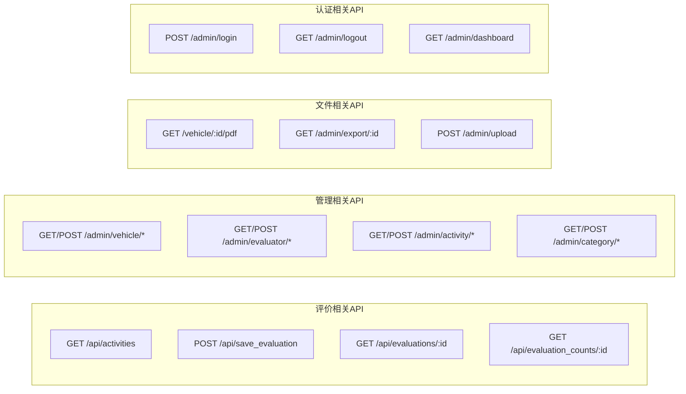

#### 4.3.2 API接口规范

**请求格式**:
```json
{
  "method": "POST",
  "url": "/api/save_evaluation",
  "headers": {
    "Content-Type": "application/json",
    "Accept": "application/json"
  },
  "body": {
    "activity_id": 1,
    "vehicle_id": 1,
    "category_id": 1,
    "evaluator_id": 1,
    "score": 8,
    "content": "评价内容"
  }
}
```

**响应格式**:
```json
{
  "success": true,
  "message": "评价保存成功",
  "data": {
    "evaluation_id": 123,
    "created_at": "2025-07-23T10:30:00Z"
  },
  "error_code": null
}
```

## 5. 部署架构设计

### 5.1 部署架构图

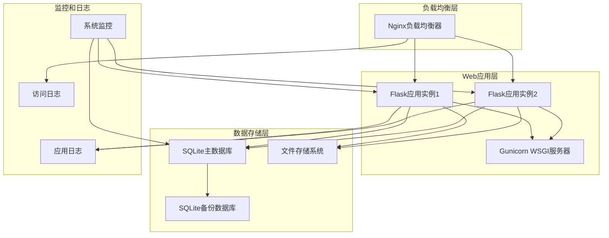

### 5.2 环境配置

#### 5.2.1 开发环境
- **操作系统**: macOS/Windows/Linux
- **Python版本**: 3.11+
- **开发工具**: PyCharm/VSCode
- **数据库**: SQLite (本地文件)
- **Web服务器**: Flask内置开发服务器

#### 5.2.2 测试环境
- **操作系统**: Linux (Ubuntu 20.04+)
- **部署方式**: Docker容器
- **数据库**: SQLite (独立测试数据)
- **Web服务器**: Gunicorn + Nginx
- **监控**: 基础日志监控

#### 5.2.3 生产环境
- **操作系统**: Linux (Ubuntu 20.04+ LTS)
- **部署方式**: 系统服务 + 进程管理
- **数据库**: SQLite (高可用配置)
- **Web服务器**: Gunicorn + Nginx
- **安全**: HTTPS + 防火墙
- **备份**: 自动数据备份
- **监控**: 完整监控和告警

### 5.3 容器化部署

#### 5.3.1 Docker配置

**Dockerfile**:
```dockerfile
FROM python:3.11-slim

WORKDIR /app

COPY requirements.txt .
RUN pip install --no-cache-dir -r requirements.txt

COPY . .

EXPOSE 5000

CMD ["gunicorn", "--bind", "0.0.0.0:5000", "app:app"]
```

**docker-compose.yml**:
```yaml
version: '3.8'

services:
  web:
    build: .
    ports:
      - "5000:5000"
    volumes:
      - ./data:/app/data
      - ./uploads:/app/uploads
    environment:
      - FLASK_ENV=production
      - DATABASE_URL=sqlite:///data/evaluation.db
    
  nginx:
    image: nginx:alpine
    ports:
      - "80:80"
      - "443:443"
    volumes:
      - ./nginx.conf:/etc/nginx/nginx.conf
      - ./ssl:/etc/nginx/ssl
    depends_on:
      - web
```

#### 5.3.2 Kubernetes部署

```yaml
apiVersion: apps/v1
kind: Deployment
metadata:
  name: evaluation-system
spec:
  replicas: 2
  selector:
    matchLabels:
      app: evaluation-system
  template:
    metadata:
      labels:
        app: evaluation-system
    spec:
      containers:
      - name: evaluation-system
        image: evaluation-system:latest
        ports:
        - containerPort: 5000
        volumeMounts:
        - name: data-volume
          mountPath: /app/data
      volumes:
      - name: data-volume
        persistentVolumeClaim:
          claimName: evaluation-data-pvc
```

## 6. 技术选型分析

### 6.1 后端技术选型

#### 6.1.1 Web框架选择

**Flask vs Django vs FastAPI**

| 特性 | Flask | Django | FastAPI |
|------|-------|--------|---------|
| 学习曲线 | ✅ 简单 | ❌ 复杂 | ⚠️ 中等 |
| 项目规模 | ✅ 中小型 | ✅ 大型 | ✅ 现代应用 |
| 开发速度 | ✅ 快速 | ✅ 快速 | ✅ 快速 |
| 生态系统 | ✅ 丰富 | ✅ 完善 | ⚠️ 新兴 |
| 性能 | ⚠️ 中等 | ⚠️ 中等 | ✅ 高性能 |

**选择Flask的理由**:
- 项目规模适中，不需要Django的重量级特性
- 团队熟悉Flask生态系统
- 快速开发和部署
- 扩展灵活性好

#### 6.1.2 数据库选择

**SQLite vs PostgreSQL vs MySQL**

| 特性 | SQLite | PostgreSQL | MySQL |
|------|--------|------------|-------|
| 部署复杂度 | ✅ 极简 | ❌ 复杂 | ⚠️ 中等 |
| 维护成本 | ✅ 低 | ❌ 高 | ⚠️ 中等 |
| 并发性能 | ⚠️ 限制 | ✅ 优秀 | ✅ 良好 |
| 数据完整性 | ✅ 可靠 | ✅ 优秀 | ✅ 良好 |
| 扩展性 | ❌ 限制 | ✅ 优秀 | ✅ 良好 |

**选择SQLite的理由**:
- 项目初期，数据量和并发量不大
- 零配置部署，降低运维复杂度
- 支持未来迁移到PostgreSQL
- 开发和测试环境一致性

#### 6.1.3 ORM选择

**SQLAlchemy vs Peewee vs Tortoise ORM**

选择**SQLAlchemy**的理由:
- Flask生态的标准ORM
- 功能完整，支持复杂查询
- 文档完善，社区活跃
- 支持多种数据库后端

### 6.2 前端技术选型

#### 6.2.1 框架选择

**原生JS+jQuery vs React vs Vue**

选择**原生JS+jQuery**的理由:
- 项目前端逻辑相对简单
- 团队熟悉度高，开发效率高
- 减少构建复杂度和依赖
- 更好的浏览器兼容性

#### 6.2.2 UI设计选择

**Bootstrap vs 自定义CSS vs Tailwind CSS**

选择**自定义CSS**的理由:
- 设计需求特殊（glassmorphism风格）
- 精确控制样式和交互
- 减少不必要的CSS体积
- 更好的移动端优化

### 6.3 部署技术选型

#### 6.3.1 Web服务器

**Nginx + Gunicorn vs Apache + mod_wsgi vs uWSGI**

选择**Nginx + Gunicorn**的理由:
- 性能优秀，资源占用低
- 配置简单，文档完善
- 支持反向代理和负载均衡
- Python WSGI应用的最佳实践

#### 6.3.2 容器化技术

**Docker vs Podman vs 原生部署**

选择**Docker + 原生部署**的理由:
- Docker提供开发环境一致性
- 原生部署降低生产环境复杂度
- 支持两种部署方式的灵活选择
- 便于CI/CD集成

## 7. 性能设计

### 7.1 性能目标

| 性能指标 | 目标值 | 测量方法 |
|----------|--------|----------|
| 页面加载时间 | ≤ 3秒 | 浏览器开发者工具 |
| API响应时间 | ≤ 1秒 | 服务器日志分析 |
| 并发用户数 | 50个 | 压力测试工具 |
| 数据库查询时间 | ≤ 500ms | SQL性能分析 |
| 文件上传时间 | ≤ 5秒 | 网络传输监控 |

### 7.2 性能优化策略

#### 7.2.1 前端性能优化

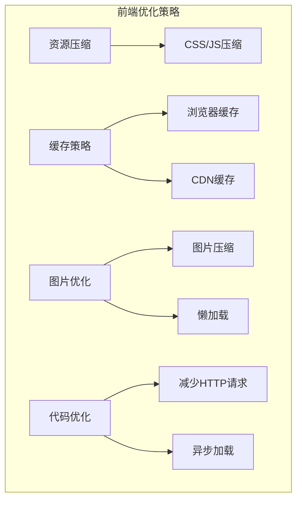

#### 7.2.2 后端性能优化

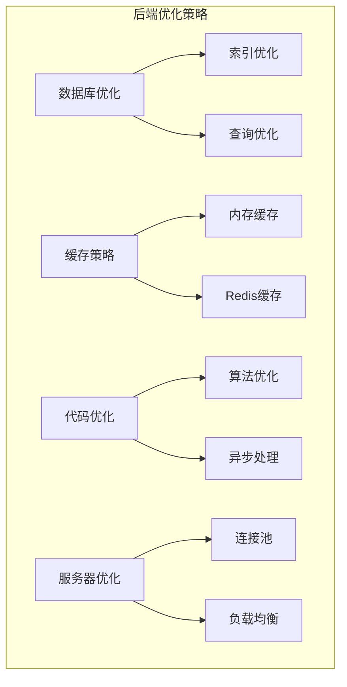

#### 7.2.3 数据库性能优化

**索引策略**:
```sql
-- 评价查询优化
CREATE INDEX idx_evaluation_activity_vehicle 
ON evaluation(activity_id, vehicle_id);

-- 时间范围查询优化
CREATE INDEX idx_evaluation_created_at 
ON evaluation(created_at);

-- 用户查询优化
CREATE INDEX idx_evaluation_evaluator 
ON evaluation(evaluator_id);
```

**查询优化**:
```python
# 使用join减少查询次数
evaluations = db.session.query(Evaluation)\
    .join(Activity)\
    .join(Vehicle)\
    .join(Evaluator)\
    .filter(Evaluation.activity_id == activity_id)\
    .all()

# 使用分页减少数据传输量
evaluations = Evaluation.query\
    .filter_by(activity_id=activity_id)\
    .paginate(page=1, per_page=20)
```

### 7.3 可扩展性设计

#### 7.3.1 水平扩展策略

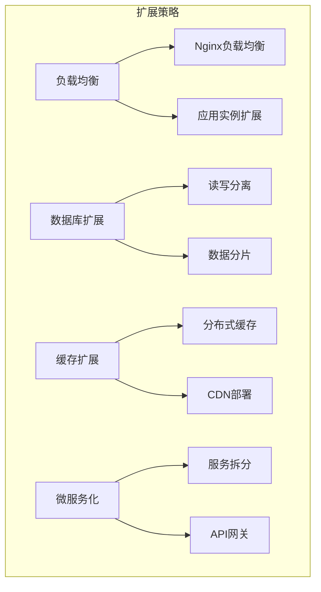

#### 7.3.2 垂直扩展策略

- **CPU扩展**: 增加服务器CPU核心数
- **内存扩展**: 增加服务器内存容量
- **存储扩展**: 使用SSD存储，提高I/O性能
- **网络扩展**: 提升网络带宽和延迟

## 8. 安全架构设计

### 8.1 安全层次设计

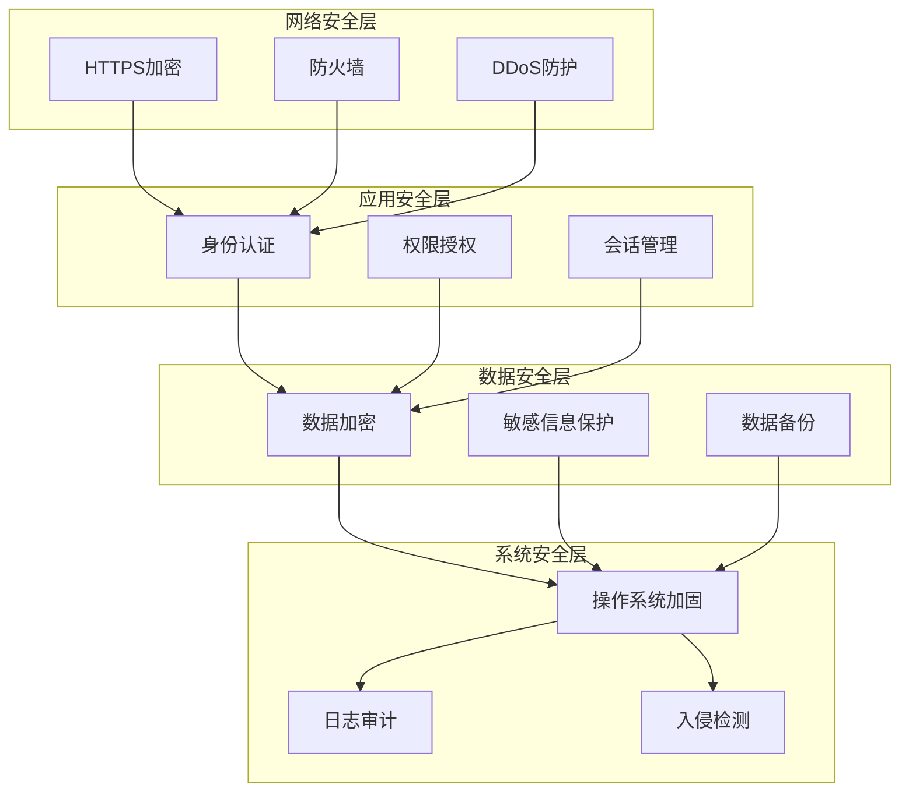

### 8.2 安全防护措施

#### 8.2.1 Web应用安全

**OWASP Top 10防护**:
- **SQL注入**: 使用ORM参数化查询
- **XSS攻击**: 输入验证和输出转义
- **CSRF攻击**: CSRF令牌验证
- **不安全的直接对象引用**: 权限检查
- **安全错误配置**: 安全配置检查清单
- **敏感数据暴露**: 数据加密和脱敏
- **访问控制缺失**: 统一权限管理
- **已知漏洞组件**: 依赖版本管理
- **未验证的重定向**: URL白名单验证
- **日志和监控不足**: 完善的日志系统

#### 8.2.2 数据保护

```python
# 密码哈希存储
from werkzeug.security import generate_password_hash

password_hash = generate_password_hash(password)

# 敏感数据加密
from cryptography.fernet import Fernet

key = Fernet.generate_key()
cipher_suite = Fernet(key)
encrypted_data = cipher_suite.encrypt(sensitive_data.encode())
```

## 9. 监控和日志架构

### 9.1 监控架构

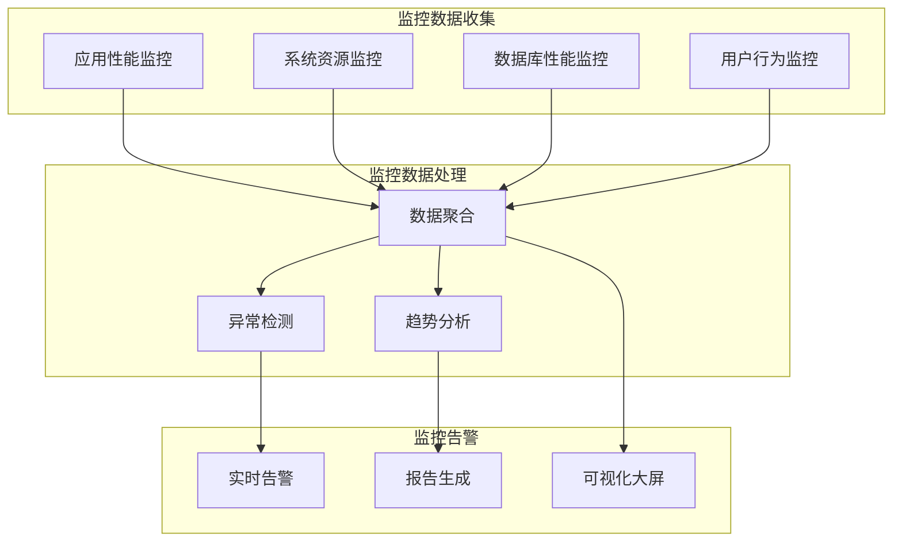

### 9.2 日志架构

#### 9.2.1 日志分类

**应用日志**:
```python
import logging

# 业务操作日志
business_logger = logging.getLogger('business')
business_logger.info(f'用户{user_id}提交评价{evaluation_id}')

# 错误日志
error_logger = logging.getLogger('error')
error_logger.error(f'数据库操作失败: {str(e)}')

# 安全日志
security_logger = logging.getLogger('security')
security_logger.warning(f'IP{client_ip}登录失败')
```

**访问日志**:
```nginx
log_format detailed '$remote_addr - $remote_user [$time_local] '
                   '"$request" $status $body_bytes_sent '
                   '"$http_referer" "$http_user_agent" '
                   '$request_time';

access_log /var/log/nginx/access.log detailed;
```

#### 9.2.2 日志管理

```python
LOGGING = {
    'version': 1,
    'disable_existing_loggers': False,
    'formatters': {
        'detailed': {
            'format': '{levelname} {asctime} {module} {process:d} {thread:d} {message}',
            'style': '{',
        },
    },
    'handlers': {
        'file': {
            'level': 'INFO',
            'class': 'logging.handlers.RotatingFileHandler',
            'filename': 'logs/application.log',
            'maxBytes': 10*1024*1024,  # 10MB
            'backupCount': 5,
            'formatter': 'detailed',
        },
    },
    'loggers': {
        'evaluation': {
            'handlers': ['file'],
            'level': 'INFO',
            'propagate': True,
        },
    },
}
```

## 10. 总结

### 10.1 架构优势

1. **技术成熟**: 采用经过验证的技术栈，降低技术风险
2. **部署简单**: 单体应用架构，部署和维护成本低
3. **性能优化**: 针对性的性能优化策略，满足业务需求
4. **安全可靠**: 多层次的安全防护，保障系统和数据安全
5. **易于扩展**: 模块化设计，支持功能和性能扩展

### 10.2 技术债务和改进计划

**短期改进**:
- 完善单元测试和集成测试
- 增加性能监控和告警
- 优化数据库查询性能

**中期改进**:
- 考虑迁移到PostgreSQL
- 引入Redis缓存
- 实现API版本管理

**长期改进**:
- 微服务架构改造
- 容器化部署优化
- 云原生架构迁移

### 10.3 架构演进路径

1. **V1.0**: 当前单体架构，满足基本业务需求
2. **V2.0**: 引入缓存和性能优化，支持更大并发
3. **V3.0**: 微服务架构，支持大规模部署
4. **V4.0**: 云原生架构，支持弹性扩展

---
**文档状态**: ✅ 已完成  
**最后更新**: 2025年7月23日  
**版本号**: 1.0