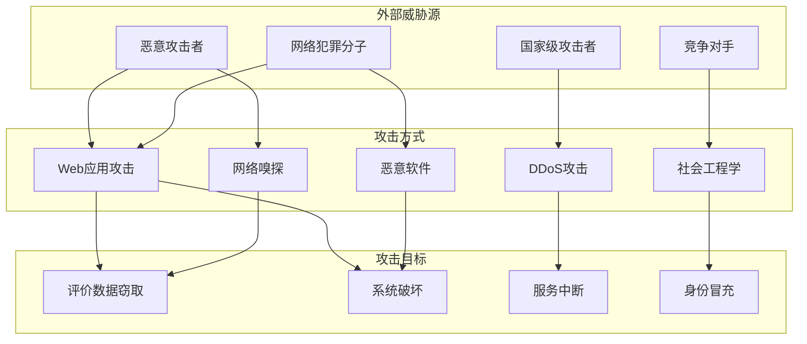
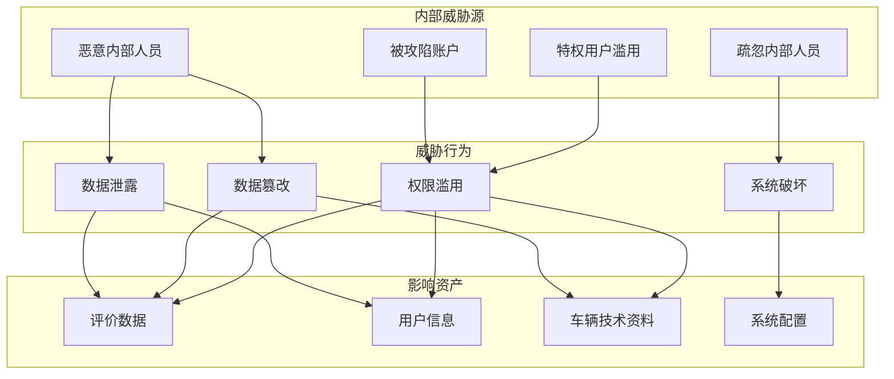
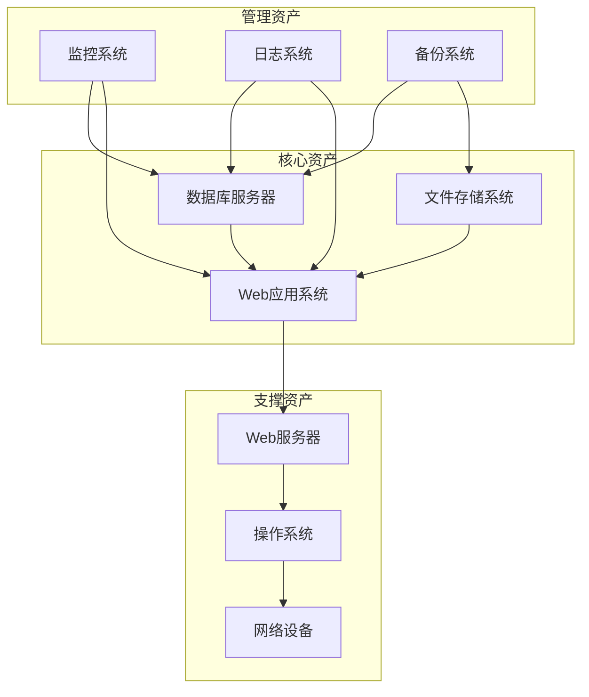
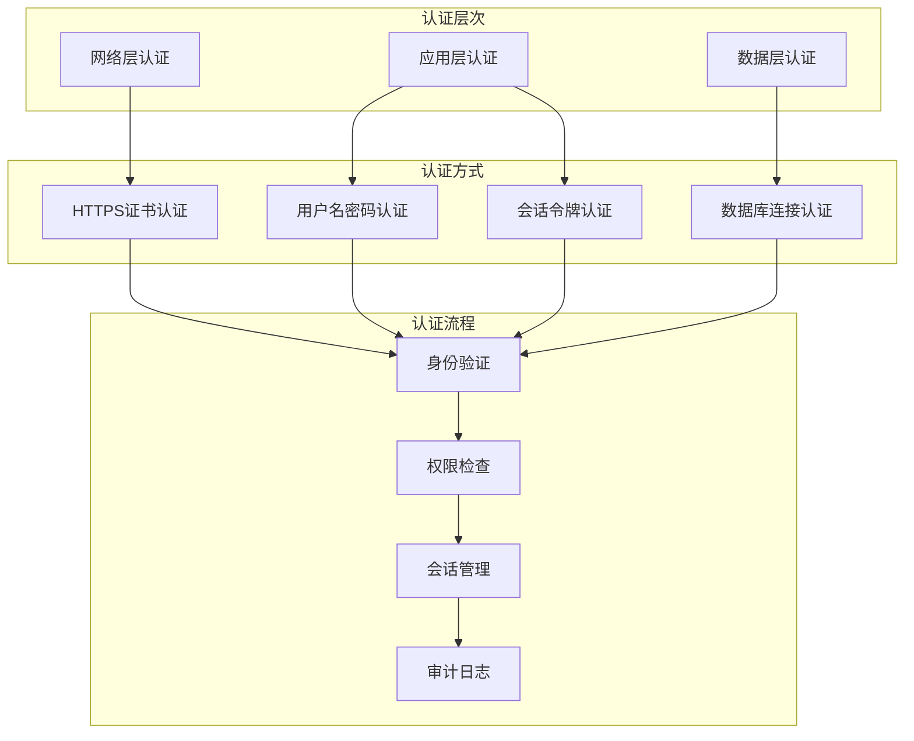
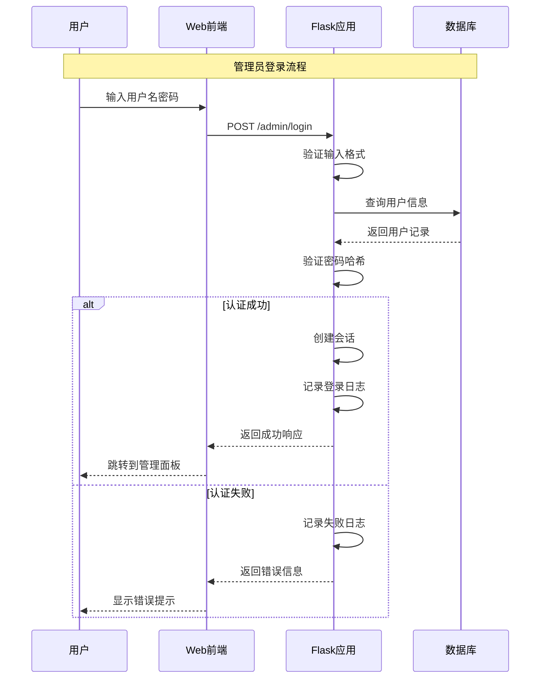
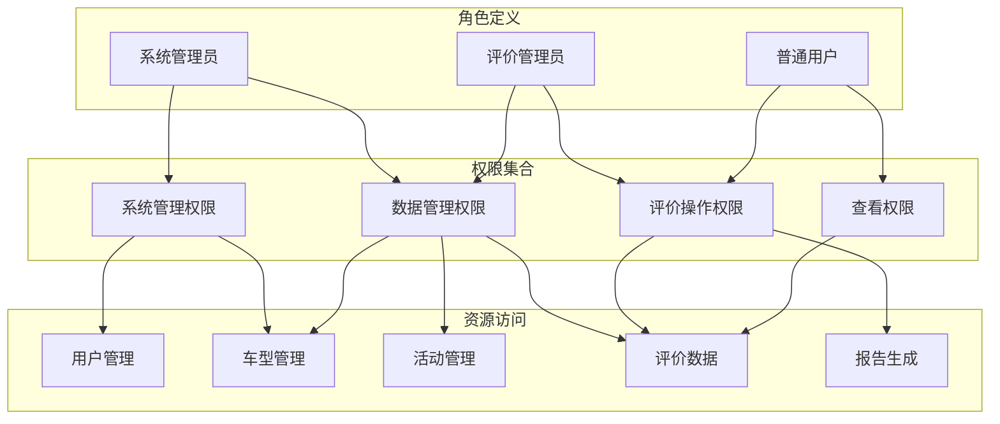
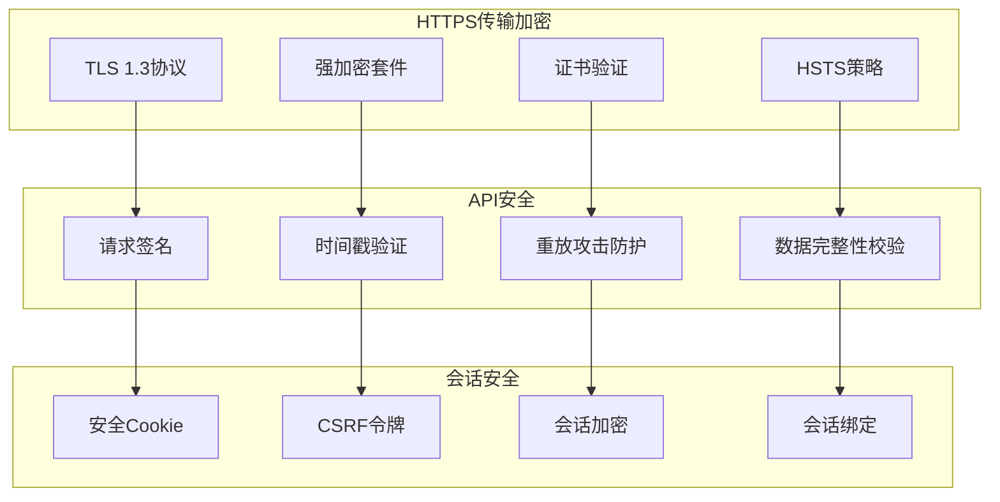
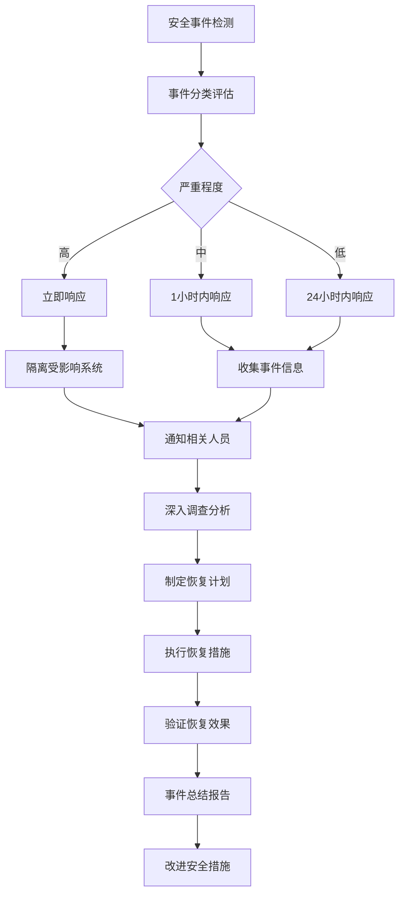

# 试车反馈评价系统安全设计文档

**文档版本：** 1.0  
**编写日期：** 2025年7月23日  
**编写人员：** 安全架构师  
**审核人员：** 首席安全官  

## 1. 引言

### 1.1 编写目的
本文档详细描述了试车反馈评价系统的安全架构设计，包括安全威胁分析、安全控制措施、数据保护机制和安全监控策略，为系统安全实施提供全面指导。

### 1.2 安全目标
- **机密性**: 保护敏感数据不被未授权访问
- **完整性**: 确保数据的准确性和完整性
- **可用性**: 保障系统的正常运行和服务可用
- **可审计性**: 记录和追踪所有安全相关操作
- **合规性**: 符合相关法规和安全标准要求

### 1.3 安全原则
- **最小权限原则**: 用户只获得完成任务所需的最小权限
- **深度防御**: 多层次安全防护，避免单点失败
- **默认拒绝**: 除非明确允许，否则默认拒绝访问
- **故障安全**: 系统故障时保持安全状态
- **安全透明**: 安全措施对用户透明，不影响使用体验

## 2. 威胁模型分析

### 2.1 威胁识别

#### 2.1.1 外部威胁



#### 2.1.2 内部威胁



### 2.2 威胁评估矩阵

| 威胁类型 | 可能性 | 影响程度 | 风险等级 | 优先级 |
|----------|--------|----------|----------|--------|
| SQL注入攻击 | 中等 | 高 | 高 | 1 |
| XSS攻击 | 高 | 中等 | 高 | 2 |
| 暴力破解登录 | 高 | 中等 | 高 | 3 |
| CSRF攻击 | 中等 | 中等 | 中 | 4 |
| 文件上传漏洞 | 低 | 高 | 中 | 5 |
| 会话劫持 | 中等 | 中等 | 中 | 6 |
| 信息泄露 | 中等 | 高 | 高 | 2 |
| DDoS攻击 | 低 | 高 | 中 | 7 |
| 内部数据滥用 | 低 | 高 | 中 | 8 |
| 物理安全威胁 | 低 | 中等 | 低 | 9 |

### 2.3 资产分类和保护等级

#### 2.3.1 数据资产分类

| 数据类型 | 敏感级别 | 保护要求 | 访问控制 |
|----------|----------|----------|----------|
| 评价数据 | 机密 | 加密存储+传输 | 认证+授权 |
| 用户账户信息 | 机密 | 哈希存储+盐值 | 严格访问控制 |
| 车辆技术文档 | 机密 | 访问日志+水印 | 角色权限控制 |
| 系统配置信息 | 限制 | 配置加密 | 管理员权限 |
| 操作日志 | 内部 | 完整性保护 | 只读权限 |
| 公开界面信息 | 公开 | 基本保护 | 无特殊要求 |

#### 2.3.2 系统资产分类



## 3. 身份认证和访问控制

### 3.1 认证架构设计

#### 3.1.1 多层认证模型



#### 3.1.2 用户认证流程



#### 3.1.3 密码安全策略

**密码强度要求**:
```python
import re
from werkzeug.security import generate_password_hash, check_password_hash

def validate_password(password):
    """密码强度验证"""
    if len(password) < 8:
        return False, "密码长度至少8位"
    
    if not re.search(r'[A-Z]', password):
        return False, "必须包含大写字母"
    
    if not re.search(r'[a-z]', password):
        return False, "必须包含小写字母"
    
    if not re.search(r'\d', password):
        return False, "必须包含数字"
    
    if not re.search(r'[!@#$%^&*]', password):
        return False, "必须包含特殊字符"
    
    return True, "密码符合要求"

def hash_password(password):
    """安全密码哈希"""
    return generate_password_hash(
        password, 
        method='pbkdf2:sha256:100000',  # 10万次迭代
        salt_length=16  # 16字节盐值
    )
```

**会话安全管理**:
```python
from flask import session
from datetime import datetime, timedelta
import secrets

class SessionManager:
    def __init__(self):
        self.session_timeout = 3600  # 1小时超时
        self.max_sessions_per_user = 3  # 每用户最大会话数
    
    def create_session(self, user_id):
        """创建安全会话"""
        session_id = secrets.token_urlsafe(32)
        session_data = {
            'user_id': user_id,
            'created_at': datetime.utcnow(),
            'last_activity': datetime.utcnow(),
            'ip_address': request.remote_addr,
            'user_agent': request.user_agent.string
        }
        
        # 存储会话信息
        self.store_session(session_id, session_data)
        return session_id
    
    def validate_session(self, session_id):
        """验证会话有效性"""
        session_data = self.get_session(session_id)
        if not session_data:
            return False
        
        # 检查超时
        if datetime.utcnow() - session_data['last_activity'] > timedelta(seconds=self.session_timeout):
            self.destroy_session(session_id)
            return False
        
        # 更新最后活动时间
        session_data['last_activity'] = datetime.utcnow()
        self.store_session(session_id, session_data)
        return True
```

### 3.2 授权控制设计

#### 3.2.1 基于角色的访问控制(RBAC)



#### 3.2.2 权限控制实现

```python
from functools import wraps
from flask import session, jsonify, request
from enum import Enum

class Permission(Enum):
    """权限枚举"""
    VIEW_EVALUATION = "view_evaluation"
    CREATE_EVALUATION = "create_evaluation"
    EDIT_EVALUATION = "edit_evaluation"
    DELETE_EVALUATION = "delete_evaluation"
    MANAGE_VEHICLE = "manage_vehicle"
    MANAGE_ACTIVITY = "manage_activity"
    MANAGE_USER = "manage_user"
    VIEW_REPORT = "view_report"
    EXPORT_REPORT = "export_report"

class Role(Enum):
    """角色枚举"""
    ADMIN = "admin"
    EVALUATOR = "evaluator"
    VIEWER = "viewer"

# 角色权限映射
ROLE_PERMISSIONS = {
    Role.ADMIN: [
        Permission.VIEW_EVALUATION,
        Permission.CREATE_EVALUATION,
        Permission.EDIT_EVALUATION,
        Permission.DELETE_EVALUATION,
        Permission.MANAGE_VEHICLE,
        Permission.MANAGE_ACTIVITY,
        Permission.MANAGE_USER,
        Permission.VIEW_REPORT,
        Permission.EXPORT_REPORT,
    ],
    Role.EVALUATOR: [
        Permission.VIEW_EVALUATION,
        Permission.CREATE_EVALUATION,
        Permission.VIEW_REPORT,
    ],
    Role.VIEWER: [
        Permission.VIEW_EVALUATION,
        Permission.VIEW_REPORT,
    ]
}

def require_permission(permission):
    """权限检查装饰器"""
    def decorator(f):
        @wraps(f)
        def decorated_function(*args, **kwargs):
            if not session.get('user_id'):
                return jsonify({'error': '未登录'}), 401
            
            user_role = session.get('user_role')
            if not user_role:
                return jsonify({'error': '无角色信息'}), 403
            
            role_enum = Role(user_role)
            if permission not in ROLE_PERMISSIONS.get(role_enum, []):
                return jsonify({'error': '权限不足'}), 403
            
            return f(*args, **kwargs)
        return decorated_function
    return decorator

# 使用示例
@app.route('/admin/vehicle/add', methods=['POST'])
@require_permission(Permission.MANAGE_VEHICLE)
def add_vehicle():
    # 车型添加逻辑
    pass
```

### 3.3 车型切换密码保护

#### 3.3.1 密码保护机制

```python
import hashlib
import time
from flask import session

class VehicleSwitchProtection:
    def __init__(self):
        # 固定密码（生产环境应从配置文件读取）
        self.switch_password_hash = hashlib.sha256("SWITCH_PASSWORD_2025".encode()).hexdigest()
        self.failed_attempts = {}  # IP地址 -> 失败次数
        self.lockout_duration = 300  # 5分钟锁定时间
        self.max_attempts = 3  # 最大尝试次数
    
    def verify_switch_password(self, password, client_ip):
        """验证切换密码"""
        # 检查是否被锁定
        if self.is_locked_out(client_ip):
            return False, "IP已被锁定，请稍后再试"
        
        # 验证密码
        password_hash = hashlib.sha256(password.encode()).hexdigest()
        if password_hash == self.switch_password_hash:
            # 清除失败记录
            self.failed_attempts.pop(client_ip, None)
            return True, "密码正确"
        else:
            # 记录失败尝试
            self.record_failed_attempt(client_ip)
            return False, "密码错误"
    
    def is_locked_out(self, client_ip):
        """检查IP是否被锁定"""
        if client_ip not in self.failed_attempts:
            return False
        
        attempts_data = self.failed_attempts[client_ip]
        if attempts_data['count'] >= self.max_attempts:
            if time.time() - attempts_data['last_attempt'] < self.lockout_duration:
                return True
            else:
                # 锁定时间已过，清除记录
                self.failed_attempts.pop(client_ip, None)
        
        return False
    
    def record_failed_attempt(self, client_ip):
        """记录失败尝试"""
        current_time = time.time()
        if client_ip in self.failed_attempts:
            self.failed_attempts[client_ip]['count'] += 1
            self.failed_attempts[client_ip]['last_attempt'] = current_time
        else:
            self.failed_attempts[client_ip] = {
                'count': 1,
                'last_attempt': current_time
            }

# 路由实现
@app.route('/api/verify_switch_password', methods=['POST'])
def verify_switch_password():
    password = request.json.get('password')
    client_ip = request.remote_addr
    
    protection = VehicleSwitchProtection()
    success, message = protection.verify_switch_password(password, client_ip)
    
    if success:
        session['can_switch_activity'] = True
        session['switch_verified_at'] = time.time()
        return jsonify({'success': True, 'message': message})
    else:
        return jsonify({'success': False, 'message': message}), 400
```

## 4. 数据安全保护

### 4.1 数据加密策略

#### 4.1.1 传输加密



**HTTPS配置**:
```nginx
server {
    listen 443 ssl http2;
    server_name evaluation-system.company.com;
    
    # SSL证书配置
    ssl_certificate /etc/ssl/certs/evaluation-system.crt;
    ssl_certificate_key /etc/ssl/private/evaluation-system.key;
    
    # 安全协议配置
    ssl_protocols TLSv1.2 TLSv1.3;
    ssl_ciphers ECDHE-RSA-AES256-GCM-SHA384:ECDHE-RSA-AES128-GCM-SHA256;
    ssl_prefer_server_ciphers off;
    
    # HSTS配置
    add_header Strict-Transport-Security "max-age=31536000; includeSubDomains" always;
    
    # 其他安全头
    add_header X-Frame-Options SAMEORIGIN;
    add_header X-Content-Type-Options nosniff;
    add_header X-XSS-Protection "1; mode=block";
    add_header Content-Security-Policy "default-src 'self'; script-src 'self' 'unsafe-inline'; style-src 'self' 'unsafe-inline'";
}
```

#### 4.1.2 数据存储加密

```python
from cryptography.fernet import Fernet
from cryptography.hazmat.primitives import hashes
from cryptography.hazmat.primitives.kdf.pbkdf2 import PBKDF2HMAC
import base64
import os

class DataEncryption:
    def __init__(self, password=None):
        """初始化加密工具"""
        if password is None:
            password = os.environ.get('ENCRYPTION_PASSWORD', 'default_password')
        
        # 生成密钥
        salt = b'evaluation_system_salt'  # 生产环境应使用随机盐值
        kdf = PBKDF2HMAC(
            algorithm=hashes.SHA256(),
            length=32,
            salt=salt,
            iterations=100000,
        )
        key = base64.urlsafe_b64encode(kdf.derive(password.encode()))
        self.cipher_suite = Fernet(key)
    
    def encrypt_data(self, data):
        """加密数据"""
        if isinstance(data, str):
            data = data.encode('utf-8')
        return self.cipher_suite.encrypt(data)
    
    def decrypt_data(self, encrypted_data):
        """解密数据"""
        decrypted = self.cipher_suite.decrypt(encrypted_data)
        return decrypted.decode('utf-8')
    
    def encrypt_sensitive_field(self, model_instance, field_name):
        """加密模型敏感字段"""
        field_value = getattr(model_instance, field_name)
        if field_value:
            encrypted_value = self.encrypt_data(field_value)
            setattr(model_instance, f'{field_name}_encrypted', encrypted_value)
            setattr(model_instance, field_name, None)  # 清除明文

# SQLAlchemy模型加密扩展
from sqlalchemy_utils import EncryptedType
from sqlalchemy_utils.types.encrypted.encrypted_type import AesEngine

class EncryptedEvaluation(db.Model):
    __tablename__ = 'encrypted_evaluation'
    
    id = db.Column(db.Integer, primary_key=True)
    # 敏感内容加密存储
    content = db.Column(EncryptedType(db.Text, secret_key, AesEngine, 'pkcs5'))
    # 其他字段...
```

### 4.2 敏感数据脱敏

#### 4.2.1 数据脱敏策略

```python
import re
import hashlib

class DataMasking:
    """数据脱敏工具类"""
    
    @staticmethod
    def mask_phone(phone):
        """手机号脱敏"""
        if not phone or len(phone) < 7:
            return phone
        return phone[:3] + '*' * 4 + phone[-4:]
    
    @staticmethod
    def mask_email(email):
        """邮箱脱敏"""
        if not email or '@' not in email:
            return email
        local, domain = email.split('@', 1)
        if len(local) <= 2:
            return '*' * len(local) + '@' + domain
        return local[:2] + '*' * (len(local) - 2) + '@' + domain
    
    @staticmethod
    def mask_name(name):
        """姓名脱敏"""
        if not name or len(name) < 2:
            return name
        return name[0] + '*' * (len(name) - 1)
    
    @staticmethod
    def hash_sensitive_id(sensitive_id):
        """敏感ID哈希化"""
        return hashlib.sha256(str(sensitive_id).encode()).hexdigest()[:16]
    
    @staticmethod
    def mask_content(content, keywords):
        """内容关键词脱敏"""
        for keyword in keywords:
            content = re.sub(
                re.escape(keyword), 
                '*' * len(keyword), 
                content, 
                flags=re.IGNORECASE
            )
        return content

# 在API响应中应用脱敏
def mask_evaluation_data(evaluation_data):
    """评价数据脱敏"""
    masking = DataMasking()
    
    if 'evaluator' in evaluation_data:
        evaluation_data['evaluator']['name'] = masking.mask_name(
            evaluation_data['evaluator']['name']
        )
        if 'phone' in evaluation_data['evaluator']:
            evaluation_data['evaluator']['phone'] = masking.mask_phone(
                evaluation_data['evaluator']['phone']
            )
    
    # 敏感内容关键词脱敏
    sensitive_keywords = ['密码', '内部', '机密', '专有技术']
    if 'content' in evaluation_data:
        evaluation_data['content'] = masking.mask_content(
            evaluation_data['content'], 
            sensitive_keywords
        )
    
    return evaluation_data
```

### 4.3 数据备份和恢复

#### 4.3.1 自动备份策略

```python
import sqlite3
import shutil
import gzip
import os
from datetime import datetime, timedelta
import logging

class DatabaseBackup:
    def __init__(self, db_path, backup_dir):
        self.db_path = db_path
        self.backup_dir = backup_dir
        self.retention_days = 30  # 备份保留30天
        
        # 确保备份目录存在
        os.makedirs(backup_dir, exist_ok=True)
        
        # 配置日志
        logging.basicConfig(level=logging.INFO)
        self.logger = logging.getLogger(__name__)
    
    def create_backup(self):
        """创建数据库备份"""
        try:
            # 生成备份文件名
            timestamp = datetime.now().strftime('%Y%m%d_%H%M%S')
            backup_filename = f'evaluation_backup_{timestamp}.db'
            backup_path = os.path.join(self.backup_dir, backup_filename)
            
            # 创建数据库备份
            conn = sqlite3.connect(self.db_path)
            backup_conn = sqlite3.connect(backup_path)
            conn.backup(backup_conn)
            backup_conn.close()
            conn.close()
            
            # 压缩备份文件
            compressed_path = backup_path + '.gz'
            with open(backup_path, 'rb') as f_in:
                with gzip.open(compressed_path, 'wb') as f_out:
                    shutil.copyfileobj(f_in, f_out)
            
            # 删除未压缩文件
            os.remove(backup_path)
            
            self.logger.info(f'数据库备份完成: {compressed_path}')
            return compressed_path
            
        except Exception as e:
            self.logger.error(f'数据库备份失败: {str(e)}')
            raise
    
    def restore_backup(self, backup_path):
        """恢复数据库备份"""
        try:
            # 解压备份文件
            temp_db_path = backup_path.replace('.gz', '')
            with gzip.open(backup_path, 'rb') as f_in:
                with open(temp_db_path, 'wb') as f_out:
                    shutil.copyfileobj(f_in, f_out)
            
            # 备份当前数据库
            current_backup = self.db_path + '.before_restore'
            shutil.copy2(self.db_path, current_backup)
            
            # 恢复数据库
            shutil.copy2(temp_db_path, self.db_path)
            
            # 清理临时文件
            os.remove(temp_db_path)
            
            self.logger.info(f'数据库恢复完成: {backup_path}')
            
        except Exception as e:
            self.logger.error(f'数据库恢复失败: {str(e)}')
            raise
    
    def cleanup_old_backups(self):
        """清理过期备份"""
        try:
            cutoff_date = datetime.now() - timedelta(days=self.retention_days)
            
            for filename in os.listdir(self.backup_dir):
                if filename.startswith('evaluation_backup_') and filename.endswith('.db.gz'):
                    file_path = os.path.join(self.backup_dir, filename)
                    file_time = datetime.fromtimestamp(os.path.getctime(file_path))
                    
                    if file_time < cutoff_date:
                        os.remove(file_path)
                        self.logger.info(f'删除过期备份: {filename}')
                        
        except Exception as e:
            self.logger.error(f'清理备份失败: {str(e)}')

# 定时备份任务
from apscheduler.schedulers.background import BackgroundScheduler

def setup_backup_scheduler():
    """设置备份调度器"""
    backup_manager = DatabaseBackup('data/evaluation.db', 'backups/')
    
    scheduler = BackgroundScheduler()
    
    # 每天凌晨2点执行备份
    scheduler.add_job(
        backup_manager.create_backup,
        'cron',
        hour=2,
        minute=0,
        id='daily_backup'
    )
    
    # 每周日清理过期备份
    scheduler.add_job(
        backup_manager.cleanup_old_backups,
        'cron',
        day_of_week=6,
        hour=3,
        minute=0,
        id='cleanup_backups'
    )
    
    scheduler.start()
    return scheduler
```

## 5. Web应用安全防护

### 5.1 OWASP Top 10防护

#### 5.1.1 注入攻击防护

```python
from sqlalchemy import text
from flask import request
import re

class SQLInjectionProtection:
    """SQL注入防护"""
    
    @staticmethod
    def validate_input(input_data, input_type='string'):
        """输入验证"""
        if input_type == 'string':
            # 检查SQL关键词
            sql_keywords = ['SELECT', 'INSERT', 'UPDATE', 'DELETE', 'DROP', 'UNION', 'SCRIPT']
            for keyword in sql_keywords:
                if keyword.upper() in str(input_data).upper():
                    raise ValueError(f'输入包含非法关键词: {keyword}')
        
        elif input_type == 'integer':
            if not str(input_data).isdigit():
                raise ValueError('必须是整数类型')
        
        elif input_type == 'email':
            email_pattern = r'^[a-zA-Z0-9._%+-]+@[a-zA-Z0-9.-]+\.[a-zA-Z]{2,}$'
            if not re.match(email_pattern, input_data):
                raise ValueError('邮箱格式不正确')
        
        return True
    
    @staticmethod
    def safe_query(query_template, params):
        """安全查询执行"""
        # 使用参数化查询
        return db.session.execute(text(query_template), params)

# XSS防护
from markupsafe import escape
import bleach

class XSSProtection:
    """XSS攻击防护"""
    
    # 允许的HTML标签和属性
    ALLOWED_TAGS = ['p', 'br', 'strong', 'em', 'u', 'ol', 'ul', 'li']
    ALLOWED_ATTRIBUTES = {}
    
    @staticmethod
    def sanitize_html(html_content):
        """HTML内容净化"""
        return bleach.clean(
            html_content,
            tags=XSSProtection.ALLOWED_TAGS,
            attributes=XSSProtection.ALLOWED_ATTRIBUTES,
            strip=True
        )
    
    @staticmethod
    def escape_output(text):
        """输出转义"""
        return escape(text)
    
    @staticmethod
    def validate_content(content):
        """内容验证"""
        # 检查脚本标签
        script_pattern = r'<script[^>]*>.*?</script>'
        if re.search(script_pattern, content, re.IGNORECASE | re.DOTALL):
            raise ValueError('内容包含非法脚本')
        
        # 检查事件处理器
        event_pattern = r'on\w+\s*='
        if re.search(event_pattern, content, re.IGNORECASE):
            raise ValueError('内容包含非法事件处理器')
        
        return True

# CSRF防护
from flask_wtf.csrf import CSRFProtect
import secrets

class CSRFProtection:
    def __init__(self, app):
        self.app = app
        app.config['SECRET_KEY'] = secrets.token_hex(16)
        self.csrf = CSRFProtect(app)
    
    def generate_csrf_token(self):
        """生成CSRF令牌"""
        return secrets.token_urlsafe(32)
    
    def validate_csrf_token(self, token):
        """验证CSRF令牌"""
        stored_token = session.get('csrf_token')
        return stored_token and stored_token == token
```

#### 5.1.2 文件上传安全

```python
import os
import magic
from werkzeug.utils import secure_filename
import hashlib

class FileUploadSecurity:
    def __init__(self):
        self.allowed_extensions = {'pdf', 'doc', 'docx', 'txt'}
        self.allowed_mime_types = {
            'application/pdf',
            'application/msword',
            'application/vnd.openxmlformats-officedocument.wordprocessingml.document',
            'text/plain'
        }
        self.max_file_size = 50 * 1024 * 1024  # 50MB
        self.upload_dir = 'uploads'
        
    def validate_file(self, file):
        """文件安全验证"""
        # 检查文件名
        if not file.filename:
            raise ValueError('文件名不能为空')
        
        # 检查文件扩展名
        filename = secure_filename(file.filename)
        ext = filename.rsplit('.', 1)[1].lower() if '.' in filename else ''
        if ext not in self.allowed_extensions:
            raise ValueError(f'不支持的文件类型: {ext}')
        
        # 检查文件大小
        file.seek(0, os.SEEK_END)
        file_size = file.tell()
        file.seek(0)
        if file_size > self.max_file_size:
            raise ValueError(f'文件大小超过限制: {file_size} bytes')
        
        # 检查MIME类型
        file_content = file.read(1024)  # 读取前1KB用于检测
        file.seek(0)
        mime_type = magic.from_buffer(file_content, mime=True)
        if mime_type not in self.allowed_mime_types:
            raise ValueError(f'不支持的文件类型: {mime_type}')
        
        return True
    
    def safe_save_file(self, file):
        """安全保存文件"""
        self.validate_file(file)
        
        # 生成安全文件名
        filename = secure_filename(file.filename)
        timestamp = int(time.time())
        file_hash = hashlib.md5(file.read()).hexdigest()[:8]
        file.seek(0)
        
        safe_filename = f'{timestamp}_{file_hash}_{filename}'
        file_path = os.path.join(self.upload_dir, safe_filename)
        
        # 确保目录存在
        os.makedirs(self.upload_dir, exist_ok=True)
        
        # 保存文件
        file.save(file_path)
        
        # 设置文件权限
        os.chmod(file_path, 0o644)
        
        return file_path
    
    def scan_uploaded_file(self, file_path):
        """扫描上传文件（可集成病毒扫描）"""
        # 基础文件检查
        if not os.path.exists(file_path):
            raise ValueError('文件不存在')
        
        # 检查文件内容（简单检查）
        with open(file_path, 'rb') as f:
            content = f.read(1024)
            # 检查是否包含可执行代码特征
            suspicious_patterns = [b'<script', b'javascript:', b'vbscript:', b'<?php']
            for pattern in suspicious_patterns:
                if pattern in content.lower():
                    os.remove(file_path)
                    raise ValueError('文件包含可疑内容')
        
        return True
```

### 5.2 会话安全管理

#### 5.2.1 安全会话配置

```python
from flask import Flask, session
import os
from datetime import timedelta

def configure_session_security(app):
    """配置会话安全"""
    # 会话密钥
    app.config['SECRET_KEY'] = os.environ.get('SECRET_KEY', os.urandom(24))
    
    # 会话配置
    app.config['SESSION_COOKIE_SECURE'] = True  # HTTPS only
    app.config['SESSION_COOKIE_HTTPONLY'] = True  # 防止XSS
    app.config['SESSION_COOKIE_SAMESITE'] = 'Lax'  # CSRF防护
    app.config['PERMANENT_SESSION_LIFETIME'] = timedelta(hours=1)  # 1小时超时
    
    # 会话中间件
    @app.before_request
    def before_request():
        session.permanent = True
        
        # 检查会话安全
        if 'user_id' in session:
            # 验证IP绑定（可选）
            if app.config.get('SESSION_IP_BINDING'):
                if session.get('ip_address') != request.remote_addr:
                    session.clear()
                    return jsonify({'error': '会话安全验证失败'}), 401
            
            # 更新最后活动时间
            session['last_activity'] = time.time()
    
    @app.after_request
    def after_request(response):
        # 设置安全头
        response.headers['X-Frame-Options'] = 'SAMEORIGIN'
        response.headers['X-Content-Type-Options'] = 'nosniff'
        response.headers['X-XSS-Protection'] = '1; mode=block'
        return response
```

### 5.3 API安全防护

#### 5.3.1 API访问控制

```python
from functools import wraps
import time
import hashlib
from collections import defaultdict

class APIRateLimiter:
    """API访问频率限制"""
    
    def __init__(self):
        self.requests = defaultdict(list)
        self.limits = {
            'default': {'requests': 100, 'window': 3600},  # 每小时100次
            'auth': {'requests': 10, 'window': 300},       # 5分钟10次认证
            'upload': {'requests': 5, 'window': 300},      # 5分钟5次上传
        }
    
    def is_allowed(self, identifier, endpoint_type='default'):
        """检查是否允许访问"""
        current_time = time.time()
        limit_config = self.limits.get(endpoint_type, self.limits['default'])
        
        # 清理过期记录
        self.requests[identifier] = [
            req_time for req_time in self.requests[identifier]
            if current_time - req_time < limit_config['window']
        ]
        
        # 检查限制
        if len(self.requests[identifier]) >= limit_config['requests']:
            return False
        
        # 记录请求
        self.requests[identifier].append(current_time)
        return True

def rate_limit(endpoint_type='default'):
    """访问频率限制装饰器"""
    limiter = APIRateLimiter()
    
    def decorator(f):
        @wraps(f)
        def decorated_function(*args, **kwargs):
            # 使用IP地址作为标识符
            identifier = request.remote_addr
            
            if not limiter.is_allowed(identifier, endpoint_type):
                return jsonify({'error': '访问频率超限'}), 429
            
            return f(*args, **kwargs)
        return decorated_function
    return decorator

# API签名验证
class APISignature:
    """API请求签名验证"""
    
    def __init__(self, secret_key):
        self.secret_key = secret_key
    
    def generate_signature(self, method, url, timestamp, data=None):
        """生成请求签名"""
        # 构建签名字符串
        sign_string = f"{method}\n{url}\n{timestamp}"
        if data:
            sign_string += f"\n{data}"
        
        # 生成HMAC签名
        signature = hashlib.sha256(
            (sign_string + self.secret_key).encode()
        ).hexdigest()
        
        return signature
    
    def verify_signature(self, signature, method, url, timestamp, data=None):
        """验证请求签名"""
        # 检查时间戳（防重放攻击）
        current_time = int(time.time())
        if abs(current_time - int(timestamp)) > 300:  # 5分钟有效期
            return False
        
        # 验证签名
        expected_signature = self.generate_signature(method, url, timestamp, data)
        return signature == expected_signature

def require_signature():
    """API签名验证装饰器"""
    signature_verifier = APISignature(app.config['API_SECRET_KEY'])
    
    def decorator(f):
        @wraps(f)
        def decorated_function(*args, **kwargs):
            # 获取签名相关头部
            signature = request.headers.get('X-Signature')
            timestamp = request.headers.get('X-Timestamp')
            
            if not signature or not timestamp:
                return jsonify({'error': '缺少签名信息'}), 400
            
            # 获取请求数据
            data = request.get_data().decode('utf-8') if request.data else None
            
            # 验证签名
            if not signature_verifier.verify_signature(
                signature, request.method, request.url, timestamp, data
            ):
                return jsonify({'error': '签名验证失败'}), 401
            
            return f(*args, **kwargs)
        return decorated_function
    return decorator
```

## 6. 安全监控和审计

### 6.1 安全日志记录

#### 6.1.1 安全事件日志

```python
import logging
import json
from datetime import datetime
from enum import Enum

class SecurityEventType(Enum):
    """安全事件类型"""
    LOGIN_SUCCESS = "login_success"
    LOGIN_FAILURE = "login_failure"
    LOGOUT = "logout"
    PASSWORD_CHANGE = "password_change"
    PERMISSION_DENIED = "permission_denied"
    SUSPICIOUS_REQUEST = "suspicious_request"
    FILE_UPLOAD = "file_upload"
    DATA_ACCESS = "data_access"
    DATA_EXPORT = "data_export"
    SYSTEM_ERROR = "system_error"

class SecurityLogger:
    def __init__(self):
        # 配置安全日志记录器
        self.logger = logging.getLogger('security')
        handler = logging.FileHandler('logs/security.log')
        formatter = logging.Formatter(
            '%(asctime)s - %(levelname)s - %(message)s'
        )
        handler.setFormatter(formatter)
        self.logger.addHandler(handler)
        self.logger.setLevel(logging.INFO)
    
    def log_security_event(self, event_type, user_id=None, ip_address=None, 
                          user_agent=None, details=None):
        """记录安全事件"""
        event_data = {
            'event_type': event_type.value,
            'timestamp': datetime.utcnow().isoformat(),
            'user_id': user_id,
            'ip_address': ip_address or request.remote_addr,
            'user_agent': user_agent or getattr(request, 'user_agent', {}).string,
            'url': getattr(request, 'url', None),
            'method': getattr(request, 'method', None),
            'details': details or {}
        }
        
        # 根据事件类型选择日志级别
        if event_type in [SecurityEventType.LOGIN_FAILURE, 
                         SecurityEventType.PERMISSION_DENIED, 
                         SecurityEventType.SUSPICIOUS_REQUEST]:
            self.logger.warning(json.dumps(event_data))
        elif event_type == SecurityEventType.SYSTEM_ERROR:
            self.logger.error(json.dumps(event_data))
        else:
            self.logger.info(json.dumps(event_data))
    
    def log_login_attempt(self, username, success, ip_address, details=None):
        """记录登录尝试"""
        event_type = SecurityEventType.LOGIN_SUCCESS if success else SecurityEventType.LOGIN_FAILURE
        self.log_security_event(
            event_type,
            user_id=username,
            ip_address=ip_address,
            details=details
        )
    
    def log_data_access(self, user_id, resource_type, resource_id, action):
        """记录数据访问"""
        self.log_security_event(
            SecurityEventType.DATA_ACCESS,
            user_id=user_id,
            details={
                'resource_type': resource_type,
                'resource_id': resource_id,
                'action': action
            }
        )
    
    def log_suspicious_activity(self, description, severity='medium'):
        """记录可疑活动"""
        self.log_security_event(
            SecurityEventType.SUSPICIOUS_REQUEST,
            details={
                'description': description,
                'severity': severity
            }
        )

# 安全装饰器
def log_security_event(event_type):
    """安全事件记录装饰器"""
    security_logger = SecurityLogger()
    
    def decorator(f):
        @wraps(f)
        def decorated_function(*args, **kwargs):
            try:
                result = f(*args, **kwargs)
                security_logger.log_security_event(
                    event_type,
                    user_id=session.get('user_id'),
                    details={'function': f.__name__, 'success': True}
                )
                return result
            except Exception as e:
                security_logger.log_security_event(
                    SecurityEventType.SYSTEM_ERROR,
                    user_id=session.get('user_id'),
                    details={'function': f.__name__, 'error': str(e)}
                )
                raise
        return decorated_function
    return decorator
```

#### 6.1.2 入侵检测系统

```python
import re
from collections import defaultdict, deque
import time

class IntrusionDetectionSystem:
    """入侵检测系统"""
    
    def __init__(self):
        self.suspicious_patterns = [
            r'(\.\./){3,}',  # 目录遍历
            r'<script[^>]*>',  # XSS攻击
            r'(union|select|insert|update|delete)',  # SQL注入
            r'eval\s*\(',  # 代码执行
            r'system\s*\(',  # 系统命令执行
        ]
        
        self.failed_logins = defaultdict(deque)  # IP -> 失败登录时间列表
        self.request_patterns = defaultdict(deque)  # IP -> 请求模式
        self.blocked_ips = set()
        
        self.security_logger = SecurityLogger()
    
    def analyze_request(self, request):
        """分析HTTP请求"""
        client_ip = request.remote_addr
        current_time = time.time()
        
        # 检查是否已被屏蔽
        if client_ip in self.blocked_ips:
            self.security_logger.log_suspicious_activity(
                f'被屏蔽IP尝试访问: {client_ip}',
                severity='high'
            )
            return False
        
        # 检查请求模式
        self._check_request_patterns(client_ip, request, current_time)
        
        # 检查可疑内容
        self._check_suspicious_content(client_ip, request)
        
        return True
    
    def _check_request_patterns(self, client_ip, request, current_time):
        """检查请求模式"""
        # 记录请求
        self.request_patterns[client_ip].append({
            'timestamp': current_time,
            'url': request.url,
            'method': request.method,
            'user_agent': request.user_agent.string
        })
        
        # 保持最近5分钟的记录
        cutoff_time = current_time - 300
        while (self.request_patterns[client_ip] and 
               self.request_patterns[client_ip][0]['timestamp'] < cutoff_time):
            self.request_patterns[client_ip].popleft()
        
        # 检查请求频率
        if len(self.request_patterns[client_ip]) > 100:  # 5分钟内超过100次请求
            self._handle_suspicious_activity(client_ip, '高频请求', 'high')
        
        # 检查扫描行为
        unique_urls = set(req['url'] for req in self.request_patterns[client_ip])
        if len(unique_urls) > 50:  # 访问过多不同URL
            self._handle_suspicious_activity(client_ip, 'URL扫描行为', 'high')
    
    def _check_suspicious_content(self, client_ip, request):
        """检查可疑内容"""
        # 检查URL参数
        query_string = request.query_string.decode('utf-8', errors='ignore')
        for pattern in self.suspicious_patterns:
            if re.search(pattern, query_string, re.IGNORECASE):
                self._handle_suspicious_activity(
                    client_ip, 
                    f'URL参数包含可疑模式: {pattern}',
                    'high'
                )
        
        # 检查POST数据
        if request.method == 'POST' and request.data:
            post_data = request.data.decode('utf-8', errors='ignore')
            for pattern in self.suspicious_patterns:
                if re.search(pattern, post_data, re.IGNORECASE):
                    self._handle_suspicious_activity(
                        client_ip,
                        f'POST数据包含可疑模式: {pattern}',
                        'high'
                    )
        
        # 检查User-Agent
        user_agent = request.user_agent.string
        suspicious_ua_patterns = [
            r'sqlmap', r'nmap', r'nikto', r'burp', r'acunetix'
        ]
        for pattern in suspicious_ua_patterns:
            if re.search(pattern, user_agent, re.IGNORECASE):
                self._handle_suspicious_activity(
                    client_ip,
                    f'可疑User-Agent: {user_agent}',
                    'medium'
                )
    
    def record_failed_login(self, client_ip):
        """记录登录失败"""
        current_time = time.time()
        self.failed_logins[client_ip].append(current_time)
        
        # 保持最近15分钟的记录
        cutoff_time = current_time - 900
        while (self.failed_logins[client_ip] and 
               self.failed_logins[client_ip][0] < cutoff_time):
            self.failed_logins[client_ip].popleft()
        
        # 检查暴力破解
        if len(self.failed_logins[client_ip]) >= 5:  # 15分钟内5次失败
            self._handle_suspicious_activity(client_ip, '疑似暴力破解', 'high')
    
    def _handle_suspicious_activity(self, client_ip, description, severity):
        """处理可疑活动"""
        self.security_logger.log_suspicious_activity(
            f'{client_ip}: {description}',
            severity=severity
        )
        
        # 高严重级别的活动自动屏蔽IP
        if severity == 'high':
            self.blocked_ips.add(client_ip)
            self.security_logger.log_security_event(
                SecurityEventType.SUSPICIOUS_REQUEST,
                details={
                    'action': 'ip_blocked',
                    'ip_address': client_ip,
                    'reason': description
                }
            )

# Flask中间件集成
def setup_intrusion_detection(app):
    """设置入侵检测中间件"""
    ids = IntrusionDetectionSystem()
    
    @app.before_request
    def check_request():
        if not ids.analyze_request(request):
            return jsonify({'error': 'Access denied'}), 403
    
    return ids
```

### 6.2 安全监控告警

#### 6.2.1 实时告警系统

```python
import smtplib
from email.mime.text import MIMEText
from email.mime.multipart import MIMEMultipart
import requests
import json

class SecurityAlertSystem:
    """安全告警系统"""
    
    def __init__(self, config):
        self.config = config
        self.alert_thresholds = {
            'failed_logins': 5,      # 5次登录失败
            'suspicious_requests': 10, # 10次可疑请求
            'system_errors': 3,       # 3次系统错误
        }
        self.alert_counts = defaultdict(int)
        self.last_alert_time = defaultdict(float)
        self.alert_cooldown = 300  # 5分钟冷却时间
    
    def check_alert_threshold(self, alert_type):
        """检查告警阈值"""
        current_time = time.time()
        
        # 检查冷却时间
        if (current_time - self.last_alert_time[alert_type]) < self.alert_cooldown:
            return False
        
        self.alert_counts[alert_type] += 1
        
        if self.alert_counts[alert_type] >= self.alert_thresholds[alert_type]:
            self.last_alert_time[alert_type] = current_time
            self.alert_counts[alert_type] = 0  # 重置计数
            return True
        
        return False
    
    def send_email_alert(self, subject, message):
        """发送邮件告警"""
        if not self.config.get('email_alerts_enabled'):
            return
        
        try:
            msg = MIMEMultipart()
            msg['From'] = self.config['smtp_from']
            msg['To'] = ', '.join(self.config['alert_recipients'])
            msg['Subject'] = f"[安全告警] {subject}"
            
            body = f"""
            安全告警通知
            
            时间: {datetime.now().strftime('%Y-%m-%d %H:%M:%S')}
            系统: 试车反馈评价系统
            
            告警详情:
            {message}
            
            请及时处理。
            """
            
            msg.attach(MIMEText(body, 'plain', 'utf-8'))
            
            server = smtplib.SMTP(self.config['smtp_server'], self.config['smtp_port'])
            server.starttls()
            server.login(self.config['smtp_username'], self.config['smtp_password'])
            server.send_message(msg)
            server.quit()
            
        except Exception as e:
            logging.error(f'发送邮件告警失败: {str(e)}')
    
    def send_webhook_alert(self, alert_data):
        """发送Webhook告警"""
        if not self.config.get('webhook_url'):
            return
        
        try:
            payload = {
                'timestamp': datetime.now().isoformat(),
                'system': '试车反馈评价系统',
                'alert_type': 'security',
                'data': alert_data
            }
            
            response = requests.post(
                self.config['webhook_url'],
                json=payload,
                timeout=10
            )
            response.raise_for_status()
            
        except Exception as e:
            logging.error(f'发送Webhook告警失败: {str(e)}')
    
    def handle_security_alert(self, alert_type, details):
        """处理安全告警"""
        if not self.check_alert_threshold(alert_type):
            return
        
        subject = f"{alert_type} 安全事件"
        message = json.dumps(details, indent=2, ensure_ascii=False)
        
        # 发送告警
        self.send_email_alert(subject, message)
        self.send_webhook_alert({
            'alert_type': alert_type,
            'details': details
        })
        
        # 记录告警日志
        logging.critical(f'安全告警触发: {alert_type} - {details}')

# 集成到安全日志系统
class EnhancedSecurityLogger(SecurityLogger):
    def __init__(self, alert_system=None):
        super().__init__()
        self.alert_system = alert_system
    
    def log_security_event(self, event_type, **kwargs):
        super().log_security_event(event_type, **kwargs)
        
        # 检查是否需要告警
        if self.alert_system:
            if event_type == SecurityEventType.LOGIN_FAILURE:
                self.alert_system.handle_security_alert(
                    'failed_logins',
                    {'event_type': event_type.value, **kwargs}
                )
            elif event_type == SecurityEventType.SUSPICIOUS_REQUEST:
                self.alert_system.handle_security_alert(
                    'suspicious_requests',
                    {'event_type': event_type.value, **kwargs}
                )
            elif event_type == SecurityEventType.SYSTEM_ERROR:
                self.alert_system.handle_security_alert(
                    'system_errors',
                    {'event_type': event_type.value, **kwargs}
                )
```

## 7. 合规性和标准

### 7.1 数据保护合规

#### 7.1.1 个人信息保护

```python
class PersonalDataProtection:
    """个人信息保护"""
    
    def __init__(self):
        self.personal_fields = {
            'evaluator': ['name', 'phone', 'email', 'department'],
            'user': ['username', 'email'],
        }
        self.data_retention_days = 365 * 3  # 3年数据保留期
    
    def anonymize_personal_data(self, data_type, data_dict):
        """个人数据匿名化"""
        if data_type not in self.personal_fields:
            return data_dict
        
        anonymized_data = data_dict.copy()
        for field in self.personal_fields[data_type]:
            if field in anonymized_data:
                anonymized_data[field] = self._anonymize_field(field, anonymized_data[field])
        
        return anonymized_data
    
    def _anonymize_field(self, field_name, field_value):
        """字段匿名化"""
        if field_name == 'name':
            return '***'
        elif field_name in ['phone', 'email']:
            return DataMasking.mask_phone(field_value) if field_name == 'phone' else DataMasking.mask_email(field_value)
        else:
            return '***匿名***'
    
    def check_data_retention(self):
        """检查数据保留期限"""
        cutoff_date = datetime.now() - timedelta(days=self.data_retention_days)
        
        # 查找过期数据
        expired_evaluations = Evaluation.query.filter(
            Evaluation.created_at < cutoff_date
        ).all()
        
        for evaluation in expired_evaluations:
            # 匿名化处理而不是删除，保留统计价值
            evaluation.content = "已匿名化处理"
            if evaluation.evaluator:
                evaluation.evaluator.name = "匿名用户"
                evaluation.evaluator.phone = None
                evaluation.evaluator.email = None
        
        db.session.commit()
        return len(expired_evaluations)
```

### 7.2 安全标准遵循

#### 7.2.1 ISO 27001 控制措施

| 控制域 | 控制措施 | 实施状态 | 说明 |
|--------|----------|----------|------|
| A.5 信息安全方针 | 信息安全方针文档 | ✅ 已实施 | 安全设计文档 |
| A.6 信息安全组织 | 安全职责分配 | ✅ 已实施 | 角色权限控制 |
| A.8 资产管理 | 资产分类标记 | ✅ 已实施 | 数据分类保护 |
| A.9 访问控制 | 用户访问管理 | ✅ 已实施 | RBAC权限模型 |
| A.10 密码学 | 加密控制 | ✅ 已实施 | 数据传输和存储加密 |
| A.11 物理和环境安全 | 安全区域 | ⚠️ 部分实施 | 服务器机房安全 |
| A.12 运行安全 | 操作程序和职责 | ✅ 已实施 | 安全运维流程 |
| A.13 通信安全 | 网络安全管理 | ✅ 已实施 | HTTPS和网络防护 |
| A.14 系统获取、开发和维护 | 开发生命周期中的安全 | ✅ 已实施 | 安全开发实践 |
| A.15 供应商关系 | 供应商服务中的信息安全 | ⚠️ 部分实施 | 第三方组件安全评估 |
| A.16 信息安全事件管理 | 事件响应 | ✅ 已实施 | 安全监控和告警 |
| A.17 业务连续性管理 | 信息安全连续性 | ✅ 已实施 | 备份和恢复机制 |
| A.18 合规性 | 法律法规遵循 | ✅ 已实施 | 数据保护合规 |

### 7.3 安全测试要求

#### 7.3.1 安全测试清单

```python
class SecurityTestSuite:
    """安全测试套件"""
    
    def __init__(self):
        self.test_results = {}
    
    def test_authentication_security(self):
        """认证安全测试"""
        tests = [
            ('密码强度验证', self._test_password_strength),
            ('暴力破解防护', self._test_brute_force_protection),
            ('会话管理安全', self._test_session_management),
            ('登录尝试限制', self._test_login_attempt_limits),
        ]
        
        results = {}
        for test_name, test_func in tests:
            try:
                results[test_name] = test_func()
            except Exception as e:
                results[test_name] = {'status': 'FAIL', 'error': str(e)}
        
        return results
    
    def test_input_validation(self):
        """输入验证测试"""
        sql_injection_payloads = [
            "' OR '1'='1",
            "'; DROP TABLE users; --",
            "1' UNION SELECT * FROM users --"
        ]
        
        xss_payloads = [
            "<script>alert('XSS')</script>",
            "javascript:alert('XSS')",
            ""
        ]
        
        results = {}
        
        # SQL注入测试
        for payload in sql_injection_payloads:
            result = self._test_sql_injection(payload)
            results[f'SQL注入测试: {payload[:20]}...'] = result
        
        # XSS测试
        for payload in xss_payloads:
            result = self._test_xss_protection(payload)
            results[f'XSS测试: {payload[:20]}...'] = result
        
        return results
    
    def test_file_upload_security(self):
        """文件上传安全测试"""
        malicious_files = [
            ('script.js', b'<script>alert("malicious")</script>', 'text/javascript'),
            ('shell.php', b'<?php system($_GET["cmd"]); ?>', 'application/x-php'),
            ('large_file.txt', b'A' * (51 * 1024 * 1024), 'text/plain'),  # 51MB文件
        ]
        
        results = {}
        for filename, content, mime_type in malicious_files:
            result = self._test_file_upload(filename, content, mime_type)
            results[f'文件上传测试: {filename}'] = result
        
        return results
    
    def _test_password_strength(self):
        """测试密码强度验证"""
        weak_passwords = ['123456', 'password', 'abc123', '12345678']
        
        for password in weak_passwords:
            is_valid, message = validate_password(password)
            if is_valid:
                return {'status': 'FAIL', 'message': f'弱密码被接受: {password}'}
        
        return {'status': 'PASS', 'message': '密码强度验证正常'}
    
    def _test_sql_injection(self, payload):
        """测试SQL注入防护"""
        try:
            # 模拟恶意输入
            result = SQLInjectionProtection.validate_input(payload)
            return {'status': 'FAIL', 'message': 'SQL注入载荷未被拦截'}
        except ValueError:
            return {'status': 'PASS', 'message': 'SQL注入防护有效'}
    
    def _test_xss_protection(self, payload):
        """测试XSS防护"""
        try:
            sanitized = XSSProtection.sanitize_html(payload)
            if payload in sanitized:
                return {'status': 'FAIL', 'message': 'XSS载荷未被过滤'}
            return {'status': 'PASS', 'message': 'XSS防护有效'}
        except:
            return {'status': 'FAIL', 'message': 'XSS防护测试异常'}
    
    def run_all_tests(self):
        """运行所有安全测试"""
        all_results = {}
        
        all_results['认证安全'] = self.test_authentication_security()
        all_results['输入验证'] = self.test_input_validation()
        all_results['文件上传安全'] = self.test_file_upload_security()
        
        return all_results
    
    def generate_security_report(self):
        """生成安全测试报告"""
        results = self.run_all_tests()
        
        total_tests = 0
        passed_tests = 0
        
        report = "# 安全测试报告\n\n"
        
        for category, tests in results.items():
            report += f"## {category}\n\n"
            for test_name, result in tests.items():
                total_tests += 1
                status = result.get('status', 'UNKNOWN')
                if status == 'PASS':
                    passed_tests += 1
                    report += f"✅ {test_name}: {result.get('message', '')}\n"
                else:
                    report += f"❌ {test_name}: {result.get('message', '')}\n"
            report += "\n"
        
        report += f"## 测试总结\n\n"
        report += f"- 总测试数: {total_tests}\n"
        report += f"- 通过测试: {passed_tests}\n"
        report += f"- 失败测试: {total_tests - passed_tests}\n"
        report += f"- 通过率: {(passed_tests/total_tests*100):.1f}%\n"
        
        return report
```

## 8. 安全运维

### 8.1 安全部署清单

#### 8.1.1 服务器安全加固

```bash
#!/bin/bash
# 服务器安全加固脚本

# 1. 系统更新
apt-get update && apt-get upgrade -y

# 2. 防火墙配置
ufw --force enable
ufw default deny incoming
ufw default allow outgoing
ufw allow 22/tcp    # SSH
ufw allow 80/tcp    # HTTP
ufw allow 443/tcp   # HTTPS

# 3. SSH安全配置
sed -i 's/#PermitRootLogin yes/PermitRootLogin no/' /etc/ssh/sshd_config
sed -i 's/#PasswordAuthentication yes/PasswordAuthentication no/' /etc/ssh/sshd_config
sed -i 's/#MaxAuthTries 6/MaxAuthTries 3/' /etc/ssh/sshd_config
systemctl restart sshd

# 4. 系统安全配置
echo "* hard core 0" >> /etc/security/limits.conf
echo "net.ipv4.conf.all.send_redirects = 0" >> /etc/sysctl.conf
echo "net.ipv4.conf.all.accept_redirects = 0" >> /etc/sysctl.conf
sysctl -p

# 5. 日志配置
mkdir -p /var/log/evaluation-system
chown www-data:www-data /var/log/evaluation-system
chmod 750 /var/log/evaluation-system

# 6. 文件权限设置
find /var/www/evaluation-system -type f -exec chmod 644 {} \;
find /var/www/evaluation-system -type d -exec chmod 755 {} \;
chmod 600 /var/www/evaluation-system/config/secrets.conf

echo "服务器安全加固完成"
```

#### 8.1.2 应用安全配置

```python
# production_config.py
import os
from datetime import timedelta

class ProductionConfig:
    """生产环境安全配置"""
    
    # 基础安全配置
    SECRET_KEY = os.environ.get('SECRET_KEY') or os.urandom(32)
    SECURITY_PASSWORD_SALT = os.environ.get('SECURITY_PASSWORD_SALT')
    
    # 数据库安全
    DATABASE_URL = os.environ.get('DATABASE_URL')
    SQLALCHEMY_DATABASE_URI = DATABASE_URL
    SQLALCHEMY_TRACK_MODIFICATIONS = False
    SQLALCHEMY_ENGINE_OPTIONS = {
        'pool_timeout': 20,
        'pool_recycle': -1,
        'pool_pre_ping': True
    }
    
    # 会话安全
    SESSION_COOKIE_SECURE = True
    SESSION_COOKIE_HTTPONLY = True
    SESSION_COOKIE_SAMESITE = 'Lax'
    PERMANENT_SESSION_LIFETIME = timedelta(hours=1)
    
    # 文件上传安全
    MAX_CONTENT_LENGTH = 50 * 1024 * 1024  # 50MB
    UPLOAD_FOLDER = '/var/uploads/evaluation-system'
    ALLOWED_EXTENSIONS = {'pdf', 'doc', 'docx'}
    
    # 安全头配置
    SECURITY_HEADERS = {
        'Strict-Transport-Security': 'max-age=31536000; includeSubDomains',
        'X-Content-Type-Options': 'nosniff',
        'X-Frame-Options': 'SAMEORIGIN',
        'X-XSS-Protection': '1; mode=block',
        'Content-Security-Policy': "default-src 'self'; script-src 'self' 'unsafe-inline'; style-src 'self' 'unsafe-inline'",
    }
    
    # 日志配置
    LOG_LEVEL = 'INFO'
    LOG_FILE = '/var/log/evaluation-system/app.log'
    SECURITY_LOG_FILE = '/var/log/evaluation-system/security.log'
    
    # 监控配置
    MONITORING_ENABLED = True
    ALERT_EMAIL_RECIPIENTS = os.environ.get('ALERT_EMAIL_RECIPIENTS', '').split(',')
    
    # API安全
    API_RATE_LIMIT = '100/hour'
    API_SECRET_KEY = os.environ.get('API_SECRET_KEY')
```

### 8.2 安全事件响应

#### 8.2.1 事件响应流程



#### 8.2.2 应急响应脚本

```python
class SecurityIncidentResponse:
    """安全事件响应"""
    
    def __init__(self):
        self.incident_levels = {
            'CRITICAL': {'response_time': 0, 'escalation': True},
            'HIGH': {'response_time': 1, 'escalation': True},
            'MEDIUM': {'response_time': 4, 'escalation': False},
            'LOW': {'response_time': 24, 'escalation': False}
        }
        
        self.response_team = {
            'security_admin': 'security@company.com',
            'system_admin': 'admin@company.com',
            'manager': 'manager@company.com'
        }
    
    def handle_incident(self, incident_type, severity, details):
        """处理安全事件"""
        incident_id = self.create_incident_record(incident_type, severity, details)
        
        # 立即响应措施
        self.immediate_response(incident_type, severity)
        
        # 通知响应团队
        self.notify_response_team(incident_id, severity, details)
        
        # 记录响应日志
        self.log_incident_response(incident_id, incident_type, severity)
        
        return incident_id
    
    def immediate_response(self, incident_type, severity):
        """立即响应措施"""
        if severity in ['CRITICAL', 'HIGH']:
            if incident_type == 'data_breach':
                self.isolate_affected_systems()
                self.backup_current_state()
            elif incident_type == 'system_compromise':
                self.block_suspicious_ips()
                self.revoke_active_sessions()
            elif incident_type == 'dos_attack':
                self.activate_ddos_protection()
    
    def isolate_affected_systems(self):
        """隔离受影响系统"""
        # 停止Web服务
        os.system('systemctl stop nginx')
        os.system('systemctl stop gunicorn')
        
        # 阻断数据库连接
        self.block_database_access()
        
        logging.critical('系统已隔离，等待进一步处理')
    
    def block_suspicious_ips(self):
        """阻断可疑IP"""
        suspicious_log = '/var/log/evaluation-system/suspicious_ips.log'
        if os.path.exists(suspicious_log):
            with open(suspicious_log, 'r') as f:
                for line in f:
                    ip = line.strip()
                    if ip:
                        os.system(f'ufw insert 1 deny from {ip}')
    
    def revoke_active_sessions(self):
        """撤销活跃会话"""
        # 清除所有会话数据
        session_store_path = '/tmp/flask_sessions'
        if os.path.exists(session_store_path):
            shutil.rmtree(session_store_path)
            os.makedirs(session_store_path)
    
    def create_incident_record(self, incident_type, severity, details):
        """创建事件记录"""
        incident_id = f'INC-{datetime.now().strftime("%Y%m%d-%H%M%S")}'
        
        incident_record = {
            'incident_id': incident_id,
            'incident_type': incident_type,
            'severity': severity,
            'timestamp': datetime.now().isoformat(),
            'details': details,
            'status': 'OPEN'
        }
        
        # 保存到事件数据库
        with open('/var/log/evaluation-system/incidents.json', 'a') as f:
            f.write(json.dumps(incident_record) + '\n')
        
        return incident_id
```

## 9. 安全维护和更新

### 9.1 定期安全评估

#### 9.1.1 安全评估清单

```python
class SecurityAssessment:
    """安全评估工具"""
    
    def __init__(self):
        self.assessment_items = {
            'vulnerability_scan': self.check_vulnerabilities,
            'access_review': self.review_access_controls,
            'log_analysis': self.analyze_security_logs,
            'configuration_review': self.review_security_configuration,
            'dependency_check': self.check_dependencies,
        }
    
    def run_full_assessment(self):
        """运行完整安全评估"""
        results = {}
        
        for item_name, check_func in self.assessment_items.items():
            try:
                results[item_name] = check_func()
            except Exception as e:
                results[item_name] = {
                    'status': 'ERROR',
                    'message': str(e)
                }
        
        return self.generate_assessment_report(results)
    
    def check_vulnerabilities(self):
        """漏洞扫描检查"""
        # 检查已知漏洞
        vulnerabilities = []
        
        # 检查Flask版本
        import flask
        flask_version = flask.__version__
        if flask_version < '2.3.0':
            vulnerabilities.append({
                'component': 'Flask',
                'version': flask_version,
                'vulnerability': 'CVE-2023-XXX',
                'severity': 'HIGH'
            })
        
        # 检查依赖包
        # ... 其他检查逻辑
        
        return {
            'status': 'PASS' if not vulnerabilities else 'FAIL',
            'vulnerabilities': vulnerabilities
        }
    
    def review_access_controls(self):
        """访问控制审查"""
        issues = []
        
        # 检查管理员账户
        admin_users = User.query.filter_by(role='admin').all()
        if len(admin_users) > 3:
            issues.append('管理员账户数量过多')
        
        # 检查密码策略
        for user in admin_users:
            # 检查密码最后修改时间
            # ... 检查逻辑
            pass
        
        return {
            'status': 'PASS' if not issues else 'WARN',
            'issues': issues
        }
```

### 9.2 安全更新管理

#### 9.2.1 自动更新脚本

```bash
#!/bin/bash
# 安全更新管理脚本

LOG_FILE="/var/log/evaluation-system/security-updates.log"
BACKUP_DIR="/var/backups/evaluation-system"

log_message() {
    echo "[$(date '+%Y-%m-%d %H:%M:%S')] $1" | tee -a "$LOG_FILE"
}

# 1. 备份当前系统
backup_system() {
    log_message "开始系统备份..."
    
    # 备份数据库
    cp /var/www/evaluation-system/data/evaluation.db "$BACKUP_DIR/evaluation-$(date +%Y%m%d).db"
    
    # 备份配置文件
    tar -czf "$BACKUP_DIR/config-$(date +%Y%m%d).tar.gz" /var/www/evaluation-system/config/
    
    log_message "系统备份完成"
}

# 2. 检查安全更新
check_security_updates() {
    log_message "检查安全更新..."
    
    # 系统包更新
    apt list --upgradable 2>/dev/null | grep -i security > /tmp/security-updates.txt
    
    # Python包更新
    cd /var/www/evaluation-system
    pip list --outdated --format=json > /tmp/python-updates.json
    
    # 检查CVE数据库
    # ... 实现CVE检查逻辑
    
    log_message "安全更新检查完成"
}

# 3. 应用安全更新
apply_security_updates() {
    log_message "应用安全更新..."
    
    # 系统安全更新
    apt-get update
    apt-get upgrade -y
    
    # Python包更新
    cd /var/www/evaluation-system
    pip install --upgrade pip
    pip install -r requirements.txt --upgrade
    
    # 重启服务
    systemctl restart nginx
    systemctl restart gunicorn
    
    log_message "安全更新应用完成"
}

# 4. 验证更新结果
verify_updates() {
    log_message "验证更新结果..."
    
    # 检查服务状态
    if systemctl is-active --quiet nginx && systemctl is-active --quiet gunicorn; then
        log_message "服务状态正常"
    else
        log_message "ERROR: 服务状态异常，需要人工介入"
        return 1
    fi
    
    # 检查应用功能
    response=$(curl -s -o /dev/null -w "%{http_code}" http://localhost/health)
    if [ "$response" = "200" ]; then
        log_message "应用功能正常"
    else
        log_message "ERROR: 应用功能异常，HTTP状态码: $response"
        return 1
    fi
    
    return 0
}

# 主流程
main() {
    log_message "开始安全更新流程"
    
    backup_system
    check_security_updates
    apply_security_updates
    
    if verify_updates; then
        log_message "安全更新流程成功完成"
    else
        log_message "ERROR: 安全更新验证失败，正在回滚..."
        # 实现回滚逻辑
        rollback_system
    fi
}

# 运行主流程
main "$@"
```

## 10. 总结

### 10.1 安全架构优势

1. **多层防护**: 从网络到应用的全方位安全防护
2. **深度监控**: 实时安全监控和告警机制
3. **合规保障**: 符合数据保护和安全标准要求
4. **响应机制**: 完善的安全事件响应流程
5. **持续改进**: 定期安全评估和更新机制

### 10.2 安全风险评估

| 风险类型 | 当前风险等级 | 控制措施 | 残余风险 |
|----------|--------------|----------|----------|
| 数据泄露 | 中等 | 访问控制+加密 | 低 |
| 系统入侵 | 中等 | 多层防护+监控 | 低 |
| 服务中断 | 低 | 备份+恢复机制 | 极低 |
| 内部威胁 | 低 | 权限控制+审计 | 低 |
| 合规风险 | 极低 | 合规框架实施 | 极低 |

### 10.3 持续改进计划

**短期改进(1-3个月)**:
- 完善入侵检测规则
- 加强文件上传安全检查
- 优化安全日志分析

**中期改进(3-6个月)**:
- 集成专业安全扫描工具
- 实施零信任安全架构
- 建立安全运营中心(SOC)

**长期改进(6-12个月)**:
- 实施AI驱动的威胁检测
- 建立安全数据湖
- 实现自动化安全响应

---
**文档状态**: ✅ 已完成  
**最后更新**: 2025年7月23日  
**版本号**: 1.0