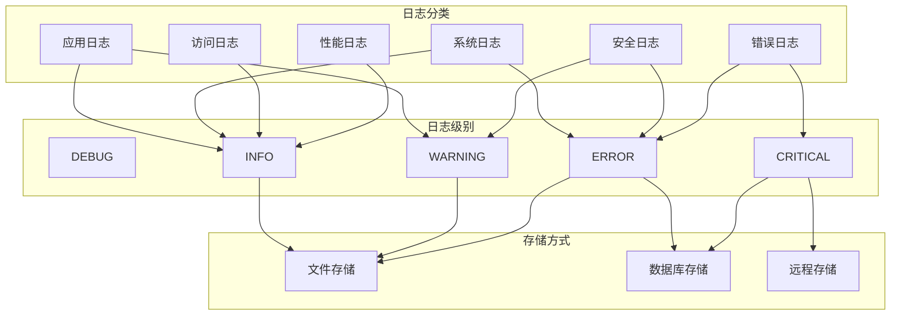
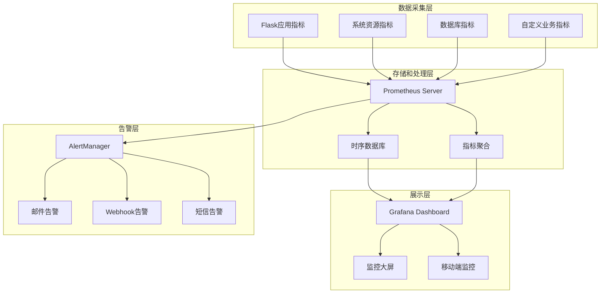

# 试车反馈评价系统日志和监控设计文档

**文档版本：** 1.0  
**编写日期：** 2025年7月23日  
**编写人员：** 运维架构师  
**审核人员：** 系统架构师  

## 1. 引言

### 1.1 编写目的
本文档详细描述了试车反馈评价系统的日志记录策略、监控机制、告警体系和运维支撑方案，为系统运维、故障排查和性能优化提供完整指导。

### 1.2 设计目标
- **全面性**: 覆盖应用、系统、安全等各个层面的日志和监控
- **实时性**: 提供实时监控和快速响应能力
- **可观测性**: 通过日志、指标、链路追踪实现系统可观测性
- **自动化**: 自动化告警、故障诊断和恢复机制
- **标准化**: 统一的日志格式和监控标准

### 1.3 技术架构
- **日志系统**: Python logging + 结构化日志
- **监控系统**: Prometheus + Grafana
- **告警系统**: AlertManager + 邮件/Webhook
- **链路追踪**: OpenTelemetry
- **日志聚合**: ELK Stack (可选)

## 2. 日志系统设计

### 2.1 日志分类体系



### 2.2 日志配置设计

#### 2.2.1 Python Logging配置

```python
import logging
import logging.handlers
import json
import os
from datetime import datetime
import traceback
from pythonjsonlogger import jsonlogger

class EvaluationSystemLogger:
    """评价系统日志管理器"""
    
    def __init__(self, app_name="evaluation-system", log_dir="/var/log/evaluation-system"):
        self.app_name = app_name
        self.log_dir = log_dir
        self.ensure_log_directory()
        self.setup_loggers()
    
    def ensure_log_directory(self):
        """确保日志目录存在"""
        os.makedirs(self.log_dir, exist_ok=True)
        
        # 设置目录权限
        os.chmod(self.log_dir, 0o755)
    
    def setup_loggers(self):
        """设置各种日志记录器"""
        
        # 1. 应用主日志
        self.app_logger = self._create_logger(
            name='evaluation.app',
            filename=f'{self.log_dir}/application.log',
            level=logging.INFO,
            max_bytes=50*1024*1024,  # 50MB
            backup_count=10
        )
        
        # 2. 错误日志
        self.error_logger = self._create_logger(
            name='evaluation.error',
            filename=f'{self.log_dir}/error.log',
            level=logging.ERROR,
            max_bytes=20*1024*1024,  # 20MB
            backup_count=15
        )
        
        # 3. 安全日志
        self.security_logger = self._create_logger(
            name='evaluation.security',
            filename=f'{self.log_dir}/security.log',
            level=logging.INFO,
            max_bytes=30*1024*1024,  # 30MB
            backup_count=20
        )
        
        # 4. 性能日志
        self.performance_logger = self._create_logger(
            name='evaluation.performance',
            filename=f'{self.log_dir}/performance.log',
            level=logging.INFO,
            max_bytes=100*1024*1024,  # 100MB
            backup_count=5
        )
        
        # 5. 审计日志
        self.audit_logger = self._create_logger(
            name='evaluation.audit',
            filename=f'{self.log_dir}/audit.log',
            level=logging.INFO,
            max_bytes=200*1024*1024,  # 200MB
            backup_count=30  # 保留更长时间
        )
    
    def _create_logger(self, name, filename, level, max_bytes, backup_count):
        """创建日志记录器"""
        logger = logging.getLogger(name)
        logger.setLevel(level)
        
        # 避免重复添加处理器
        if logger.handlers:
            return logger
        
        # 文件处理器（带轮转）
        file_handler = logging.handlers.RotatingFileHandler(
            filename=filename,
            maxBytes=max_bytes,
            backupCount=backup_count,
            encoding='utf-8'
        )
        
        # JSON格式化器
        json_formatter = jsonlogger.JsonFormatter(
            fmt='%(asctime)s %(name)s %(levelname)s %(message)s %(pathname)s %(lineno)d',
            datefmt='%Y-%m-%d %H:%M:%S'
        )
        file_handler.setFormatter(json_formatter)
        
        # 控制台处理器（开发环境）
        if os.environ.get('FLASK_ENV') == 'development':
            console_handler = logging.StreamHandler()
            console_formatter = logging.Formatter(
                '%(asctime)s - %(name)s - %(levelname)s - %(message)s'
            )
            console_handler.setFormatter(console_formatter)
            logger.addHandler(console_handler)
        
        logger.addHandler(file_handler)
        return logger
    
    def get_logger(self, logger_type='app'):
        """获取指定类型的日志记录器"""
        loggers = {
            'app': self.app_logger,
            'error': self.error_logger,
            'security': self.security_logger,
            'performance': self.performance_logger,
            'audit': self.audit_logger
        }
        return loggers.get(logger_type, self.app_logger)

# 全局日志管理器实例
log_manager = EvaluationSystemLogger()
```

#### 2.2.2 结构化日志格式

```python
import json
from datetime import datetime
from flask import request, g
import uuid

class StructuredLogger:
    """结构化日志记录器"""
    
    def __init__(self, logger_manager):
        self.logger_manager = logger_manager
    
    def log_application_event(self, event_type, message, **kwargs):
        """记录应用事件"""
        log_data = {
            'timestamp': datetime.utcnow().isoformat(),
            'event_type': event_type,
            'message': message,
            'request_id': self._get_request_id(),
            'user_id': self._get_user_id(),
            'session_id': self._get_session_id(),
            'remote_addr': self._get_remote_addr(),
            'user_agent': self._get_user_agent(),
            'extra_data': kwargs
        }
        
        logger = self.logger_manager.get_logger('app')
        logger.info(json.dumps(log_data, ensure_ascii=False))
    
    def log_error(self, error, context=None):
        """记录错误信息"""
        log_data = {
            'timestamp': datetime.utcnow().isoformat(),
            'error_type': type(error).__name__,
            'error_message': str(error),
            'traceback': traceback.format_exc(),
            'request_id': self._get_request_id(),
            'user_id': self._get_user_id(),
            'request_url': getattr(request, 'url', None),
            'request_method': getattr(request, 'method', None),
            'context': context or {}
        }
        
        logger = self.logger_manager.get_logger('error')
        logger.error(json.dumps(log_data, ensure_ascii=False))
    
    def log_security_event(self, event_type, severity='INFO', details=None):
        """记录安全事件"""
        log_data = {
            'timestamp': datetime.utcnow().isoformat(),
            'event_type': event_type,
            'severity': severity,
            'user_id': self._get_user_id(),
            'remote_addr': self._get_remote_addr(),
            'user_agent': self._get_user_agent(),
            'request_url': getattr(request, 'url', None),
            'session_id': self._get_session_id(),
            'details': details or {}
        }
        
        logger = self.logger_manager.get_logger('security')
        if severity == 'CRITICAL':
            logger.critical(json.dumps(log_data, ensure_ascii=False))
        elif severity == 'ERROR':
            logger.error(json.dumps(log_data, ensure_ascii=False))
        elif severity == 'WARNING':
            logger.warning(json.dumps(log_data, ensure_ascii=False))
        else:
            logger.info(json.dumps(log_data, ensure_ascii=False))
    
    def log_performance_metric(self, metric_name, value, unit='ms', **tags):
        """记录性能指标"""
        log_data = {
            'timestamp': datetime.utcnow().isoformat(),
            'metric_name': metric_name,
            'value': value,
            'unit': unit,
            'request_id': self._get_request_id(),
            'endpoint': getattr(request, 'endpoint', None),
            'method': getattr(request, 'method', None),
            'tags': tags
        }
        
        logger = self.logger_manager.get_logger('performance')
        logger.info(json.dumps(log_data, ensure_ascii=False))
    
    def log_audit_event(self, action, resource_type, resource_id, old_values=None, new_values=None):
        """记录审计事件"""
        log_data = {
            'timestamp': datetime.utcnow().isoformat(),
            'action': action,  # CREATE, READ, UPDATE, DELETE
            'resource_type': resource_type,  # evaluation, vehicle, activity, etc.
            'resource_id': resource_id,
            'user_id': self._get_user_id(),
            'session_id': self._get_session_id(),
            'remote_addr': self._get_remote_addr(),
            'old_values': old_values,
            'new_values': new_values,
            'request_id': self._get_request_id()
        }
        
        logger = self.logger_manager.get_logger('audit')
        logger.info(json.dumps(log_data, ensure_ascii=False))
    
    def _get_request_id(self):
        """获取请求ID"""
        if hasattr(g, 'request_id'):
            return g.request_id
        return str(uuid.uuid4())
    
    def _get_user_id(self):
        """获取用户ID"""
        from flask_login import current_user
        if current_user and current_user.is_authenticated:
            return current_user.id
        return None
    
    def _get_session_id(self):
        """获取会话ID"""
        from flask import session
        return session.get('session_id', None)
    
    def _get_remote_addr(self):
        """获取客户端IP"""
        return getattr(request, 'remote_addr', None)
    
    def _get_user_agent(self):
        """获取用户代理"""
        return getattr(request, 'headers', {}).get('User-Agent', None)

# 全局结构化日志记录器
structured_logger = StructuredLogger(log_manager)
```

### 2.3 日志中间件和装饰器

#### 2.3.1 Flask请求日志中间件

```python
from functools import wraps
import time
from flask import request, g
import uuid

def setup_request_logging(app):
    """设置请求日志中间件"""
    
    @app.before_request
    def before_request():
        """请求开始时的处理"""
        # 生成请求ID
        g.request_id = str(uuid.uuid4())
        g.start_time = time.time()
        
        # 记录请求开始
        structured_logger.log_application_event(
            event_type='request_start',
            message=f'{request.method} {request.url}',
            request_method=request.method,
            request_url=request.url,
            request_headers=dict(request.headers),
            request_args=dict(request.args)
        )
    
    @app.after_request
    def after_request(response):
        """请求结束时的处理"""
        # 计算处理时间
        processing_time = (time.time() - g.start_time) * 1000  # 毫秒
        
        # 记录请求结束
        structured_logger.log_application_event(
            event_type='request_end',
            message=f'{request.method} {request.url} - {response.status_code}',
            request_method=request.method,
            request_url=request.url,
            response_status=response.status_code,
            processing_time_ms=processing_time
        )
        
        # 记录性能指标
        structured_logger.log_performance_metric(
            metric_name='request_duration',
            value=processing_time,
            unit='ms',
            method=request.method,
            endpoint=request.endpoint,
            status_code=response.status_code
        )
        
        # 慢请求告警
        if processing_time > 5000:  # 超过5秒
            structured_logger.log_application_event(
                event_type='slow_request',
                message=f'Slow request detected: {processing_time:.2f}ms',
                processing_time_ms=processing_time,
                request_url=request.url
            )
        
        return response
    
    @app.errorhandler(Exception)
    def handle_exception(error):
        """全局异常处理"""
        structured_logger.log_error(
            error=error,
            context={
                'request_method': request.method,
                'request_url': request.url,
                'request_args': dict(request.args),
                'request_form': dict(request.form) if request.form else None
            }
        )
        
        # 返回错误响应
        return {
            'error': 'Internal server error',
            'request_id': g.request_id
        }, 500

def log_function_execution(logger_type='app'):
    """函数执行日志装饰器"""
    def decorator(func):
        @wraps(func)
        def wrapper(*args, **kwargs):
            func_name = f"{func.__module__}.{func.__name__}"
            start_time = time.time()
            
            try:
                # 记录函数开始执行
                structured_logger.log_application_event(
                    event_type='function_start',
                    message=f'Function {func_name} started',
                    function_name=func_name,
                    args_count=len(args),
                    kwargs_keys=list(kwargs.keys())
                )
                
                result = func(*args, **kwargs)
                
                # 记录函数执行成功
                execution_time = (time.time() - start_time) * 1000
                structured_logger.log_application_event(
                    event_type='function_success',
                    message=f'Function {func_name} completed',
                    function_name=func_name,
                    execution_time_ms=execution_time
                )
                
                return result
                
            except Exception as e:
                # 记录函数执行错误
                execution_time = (time.time() - start_time) * 1000
                structured_logger.log_error(
                    error=e,
                    context={
                        'function_name': func_name,
                        'execution_time_ms': execution_time,
                        'args_count': len(args),
                        'kwargs': kwargs
                    }
                )
                raise
        return wrapper
    return decorator

def log_database_operations():
    """数据库操作日志装饰器"""
    def decorator(func):
        @wraps(func)
        def wrapper(*args, **kwargs):
            operation_start = time.time()
            
            try:
                result = func(*args, **kwargs)
                
                # 记录成功的数据库操作
                execution_time = (time.time() - operation_start) * 1000
                structured_logger.log_performance_metric(
                    metric_name='database_operation_duration',
                    value=execution_time,
                    unit='ms',
                    operation=func.__name__,
                    success=True
                )
                
                return result
                
            except Exception as e:
                # 记录失败的数据库操作
                execution_time = (time.time() - operation_start) * 1000
                structured_logger.log_error(
                    error=e,
                    context={
                        'operation': func.__name__,
                        'execution_time_ms': execution_time,
                        'operation_type': 'database'
                    }
                )
                
                structured_logger.log_performance_metric(
                    metric_name='database_operation_duration',
                    value=execution_time,
                    unit='ms',
                    operation=func.__name__,
                    success=False
                )
                raise
                
        return wrapper
    return decorator
```

## 3. 监控系统设计

### 3.1 监控架构



### 3.2 指标采集设计

#### 3.2.1 应用指标采集

```python
import time
from prometheus_client import Counter, Histogram, Gauge, CollectorRegistry, generate_latest
from flask import Response
import psutil
import sqlite3

class EvaluationSystemMetrics:
    """评价系统指标采集器"""
    
    def __init__(self):
        self.registry = CollectorRegistry()
        self.setup_metrics()
    
    def setup_metrics(self):
        """设置监控指标"""
        
        # 1. HTTP请求指标
        self.http_requests_total = Counter(
            'http_requests_total',
            'Total HTTP requests',
            ['method', 'endpoint', 'status_code'],
            registry=self.registry
        )
        
        self.http_request_duration = Histogram(
            'http_request_duration_seconds',
            'HTTP request duration in seconds',
            ['method', 'endpoint'],
            registry=self.registry,
            buckets=(0.1, 0.25, 0.5, 1.0, 2.5, 5.0, 10.0)
        )
        
        # 2. 数据库指标
        self.db_operations_total = Counter(
            'db_operations_total',
            'Total database operations',
            ['operation', 'table', 'status'],
            registry=self.registry
        )
        
        self.db_operation_duration = Histogram(
            'db_operation_duration_seconds',
            'Database operation duration in seconds',
            ['operation', 'table'],
            registry=self.registry
        )
        
        self.db_connections_active = Gauge(
            'db_connections_active',
            'Active database connections',
            registry=self.registry
        )
        
        # 3. 业务指标
        self.evaluations_total = Counter(
            'evaluations_total',
            'Total evaluations created',
            ['category', 'activity_id'],
            registry=self.registry
        )
        
        self.users_active = Gauge(
            'users_active',
            'Currently active users',
            registry=self.registry
        )
        
        self.evaluations_score_distribution = Histogram(
            'evaluations_score_distribution',
            'Distribution of evaluation scores',
            registry=self.registry,
            buckets=(1, 2, 3, 4, 5, 6, 7, 8, 9, 10)
        )
        
        # 4. 系统资源指标
        self.system_cpu_usage = Gauge(
            'system_cpu_usage_percent',
            'System CPU usage percentage',
            registry=self.registry
        )
        
        self.system_memory_usage = Gauge(
            'system_memory_usage_bytes',
            'System memory usage in bytes',
            registry=self.registry
        )
        
        self.system_disk_usage = Gauge(
            'system_disk_usage_percent',
            'System disk usage percentage',
            ['mount_point'],
            registry=self.registry
        )
        
        # 5. 错误指标
        self.errors_total = Counter(
            'errors_total',
            'Total application errors',
            ['error_type', 'severity'],
            registry=self.registry
        )
        
        self.security_events_total = Counter(
            'security_events_total',
            'Total security events',
            ['event_type', 'severity'],
            registry=self.registry
        )
    
    def record_http_request(self, method, endpoint, status_code, duration):
        """记录HTTP请求指标"""
        self.http_requests_total.labels(
            method=method,
            endpoint=endpoint,
            status_code=status_code
        ).inc()
        
        self.http_request_duration.labels(
            method=method,
            endpoint=endpoint
        ).observe(duration)
    
    def record_db_operation(self, operation, table, duration, success=True):
        """记录数据库操作指标"""
        status = 'success' if success else 'error'
        
        self.db_operations_total.labels(
            operation=operation,
            table=table,
            status=status
        ).inc()
        
        self.db_operation_duration.labels(
            operation=operation,
            table=table
        ).observe(duration)
    
    def record_evaluation_created(self, category, activity_id, score):
        """记录评价创建指标"""
        self.evaluations_total.labels(
            category=category,
            activity_id=str(activity_id)
        ).inc()
        
        self.evaluations_score_distribution.observe(score)
    
    def record_error(self, error_type, severity='error'):
        """记录错误指标"""
        self.errors_total.labels(
            error_type=error_type,
            severity=severity
        ).inc()
    
    def record_security_event(self, event_type, severity='info'):
        """记录安全事件指标"""
        self.security_events_total.labels(
            event_type=event_type,
            severity=severity
        ).inc()
    
    def update_system_metrics(self):
        """更新系统资源指标"""
        # CPU使用率
        cpu_percent = psutil.cpu_percent(interval=1)
        self.system_cpu_usage.set(cpu_percent)
        
        # 内存使用情况
        memory = psutil.virtual_memory()
        self.system_memory_usage.set(memory.used)
        
        # 磁盘使用情况
        for disk in psutil.disk_partitions():
            try:
                usage = psutil.disk_usage(disk.mountpoint)
                self.system_disk_usage.labels(
                    mount_point=disk.mountpoint
                ).set(usage.percent)
            except PermissionError:
                continue
    
    def get_metrics(self):
        """获取所有指标数据"""
        self.update_system_metrics()
        return generate_latest(self.registry)

# 全局指标采集器
metrics_collector = EvaluationSystemMetrics()

# Flask路由暴露指标
@app.route('/metrics')
def metrics():
    """Prometheus指标端点"""
    return Response(
        metrics_collector.get_metrics(),
        mimetype='text/plain'
    )
```

#### 3.2.2 指标中间件集成

```python
def setup_metrics_middleware(app, metrics_collector):
    """设置指标采集中间件"""
    
    @app.before_request
    def before_request_metrics():
        g.start_time = time.time()
    
    @app.after_request
    def after_request_metrics(response):
        # 计算请求处理时间
        duration = time.time() - g.start_time
        
        # 记录HTTP请求指标
        metrics_collector.record_http_request(
            method=request.method,
            endpoint=request.endpoint or 'unknown',
            status_code=response.status_code,
            duration=duration
        )
        
        return response
    
    @app.errorhandler(Exception)
    def error_handler_metrics(error):
        # 记录错误指标
        metrics_collector.record_error(
            error_type=type(error).__name__,
            severity='critical' if hasattr(error, 'code') and error.code >= 500 else 'error'
        )
        
        return {'error': 'Internal server error'}, 500

# 数据库操作指标装饰器
def monitor_db_operation(operation, table):
    """数据库操作监控装饰器"""
    def decorator(func):
        @wraps(func)
        def wrapper(*args, **kwargs):
            start_time = time.time()
            success = True
            
            try:
                result = func(*args, **kwargs)
                return result
            except Exception as e:
                success = False
                raise
            finally:
                duration = time.time() - start_time
                metrics_collector.record_db_operation(
                    operation=operation,
                    table=table,
                    duration=duration,
                    success=success
                )
        return wrapper
    return decorator

# 业务指标记录函数
def record_business_metric(metric_type, **labels):
    """记录业务指标"""
    if metric_type == 'evaluation_created':
        metrics_collector.record_evaluation_created(
            category=labels.get('category'),
            activity_id=labels.get('activity_id'),
            score=labels.get('score')
        )
    elif metric_type == 'user_login':
        # 更新活跃用户数
        # 这里可以实现更复杂的活跃用户统计逻辑
        pass
```

### 3.3 Grafana仪表板配置

#### 3.3.1 系统概览仪表板

```json
{
  "dashboard": {
    "title": "试车评价系统 - 系统概览",
    "tags": ["evaluation-system", "overview"],
    "panels": [
      {
        "title": "HTTP请求统计",
        "type": "graph",
        "targets": [
          {
            "expr": "rate(http_requests_total[5m])",
            "legendFormat": "{{method}} {{endpoint}}"
          }
        ],
        "yAxes": [
          {
            "label": "请求/秒"
          }
        ]
      },
      {
        "title": "响应时间分布",
        "type": "heatmap",
        "targets": [
          {
            "expr": "rate(http_request_duration_seconds_bucket[5m])",
            "legendFormat": "{{le}}"
          }
        ]
      },
      {
        "title": "错误率",
        "type": "stat",
        "targets": [
          {
            "expr": "rate(http_requests_total{status_code=~\"4..|5..\"}[5m]) / rate(http_requests_total[5m]) * 100",
            "legendFormat": "错误率 %"
          }
        ],
        "thresholds": [
          {"color": "green", "value": 0},
          {"color": "yellow", "value": 1},
          {"color": "red", "value": 5}
        ]
      },
      {
        "title": "系统资源使用情况",
        "type": "graph",
        "targets": [
          {
            "expr": "system_cpu_usage_percent",
            "legendFormat": "CPU使用率 %"
          },
          {
            "expr": "system_memory_usage_bytes / 1024 / 1024",
            "legendFormat": "内存使用 MB"
          }
        ]
      }
    ]
  }
}
```

#### 3.3.2 业务监控仪表板

```json
{
  "dashboard": {
    "title": "试车评价系统 - 业务监控",
    "tags": ["evaluation-system", "business"],
    "panels": [
      {
        "title": "评价创建趋势",
        "type": "graph",
        "targets": [
          {
            "expr": "rate(evaluations_total[1h])",
            "legendFormat": "{{category}}"
          }
        ]
      },
      {
        "title": "评分分布",
        "type": "histogram",
        "targets": [
          {
            "expr": "evaluations_score_distribution",
            "legendFormat": "评分{{le}}"
          }
        ]
      },
      {
        "title": "活跃用户数",
        "type": "stat",
        "targets": [
          {
            "expr": "users_active",
            "legendFormat": "当前活跃用户"
          }
        ]
      },
      {
        "title": "数据库操作性能",
        "type": "graph",
        "targets": [
          {
            "expr": "rate(db_operations_total[5m])",
            "legendFormat": "{{operation}} {{table}}"
          }
        ]
      }
    ]
  }
}
```

## 4. 告警系统设计

### 4.1 告警规则配置

#### 4.1.1 Prometheus告警规则

```yaml
# evaluation-system-alerts.yml
groups:
  - name: evaluation-system-alerts
    rules:
      # 系统级别告警
      - alert: HighCPUUsage
        expr: system_cpu_usage_percent > 80
        for: 5m
        labels:
          severity: warning
          service: evaluation-system
        annotations:
          summary: "系统CPU使用率过高"
          description: "CPU使用率已达到 {{ $value }}%，持续5分钟"
      
      - alert: HighMemoryUsage
        expr: system_memory_usage_bytes / (1024*1024*1024) > 2
        for: 5m
        labels:
          severity: warning
          service: evaluation-system
        annotations:
          summary: "系统内存使用过高"
          description: "内存使用已达到 {{ $value }}GB"
      
      - alert: DiskSpaceAlert
        expr: system_disk_usage_percent > 85
        for: 2m
        labels:
          severity: critical
          service: evaluation-system
        annotations:
          summary: "磁盘空间不足"
          description: "磁盘 {{ $labels.mount_point }} 使用率已达到 {{ $value }}%"
      
      # 应用级别告警
      - alert: HighErrorRate
        expr: rate(http_requests_total{status_code=~"5.."}[5m]) / rate(http_requests_total[5m]) > 0.05
        for: 3m
        labels:
          severity: critical
          service: evaluation-system
        annotations:
          summary: "HTTP错误率过高"
          description: "5xx错误率已达到 {{ $value | humanizePercentage }}"
      
      - alert: SlowResponseTime
        expr: histogram_quantile(0.95, rate(http_request_duration_seconds_bucket[5m])) > 5
        for: 5m
        labels:
          severity: warning
          service: evaluation-system
        annotations:
          summary: "响应时间过慢"
          description: "95%的请求响应时间超过5秒"
      
      - alert: DatabaseConnectionIssue
        expr: db_connections_active > 15
        for: 2m
        labels:
          severity: warning
          service: evaluation-system
        annotations:
          summary: "数据库连接数过多"
          description: "当前活跃数据库连接数: {{ $value }}"
      
      # 业务级别告警
      - alert: NoEvaluationsCreated
        expr: increase(evaluations_total[1h]) == 0
        for: 1h
        labels:
          severity: warning
          service: evaluation-system
        annotations:
          summary: "长时间无评价创建"
          description: "过去1小时内没有新的评价创建"
      
      - alert: SecurityEventSpike
        expr: increase(security_events_total{severity="critical"}[10m]) > 5
        for: 0m
        labels:
          severity: critical
          service: evaluation-system
        annotations:
          summary: "安全事件激增"
          description: "10分钟内发生了 {{ $value }} 次严重安全事件"
      
      # 系统健康检查
      - alert: ServiceDown
        expr: up{job="evaluation-system"} == 0
        for: 1m
        labels:
          severity: critical
          service: evaluation-system
        annotations:
          summary: "服务不可用"
          description: "评价系统服务已停止响应"
```

#### 4.1.2 AlertManager配置

```yaml
# alertmanager.yml
global:
  smtp_smarthost: 'localhost:587'
  smtp_from: 'alerts@company.com'
  smtp_auth_username: 'alerts@company.com'
  smtp_auth_password: 'password'

route:
  group_by: ['alertname', 'service']
  group_wait: 10s
  group_interval: 30s
  repeat_interval: 12h
  receiver: 'default-receiver'
  routes:
    - match:
        severity: critical
      receiver: 'critical-alerts'
      group_wait: 5s
      repeat_interval: 5m
    - match:
        severity: warning
      receiver: 'warning-alerts'
      repeat_interval: 1h

receivers:
  - name: 'default-receiver'
    email_configs:
      - to: 'ops-team@company.com'
        subject: '[ALERT] {{ .GroupLabels.service }} - {{ .GroupLabels.alertname }}'
        body: |
          {{ range .Alerts }}
          告警名称: {{ .Annotations.summary }}
          告警描述: {{ .Annotations.description }}
          告警时间: {{ .StartsAt.Format "2006-01-02 15:04:05" }}
          告警标签: {{ .Labels }}
          
          {{ end }}
  
  - name: 'critical-alerts'
    email_configs:
      - to: 'ops-team@company.com,manager@company.com'
        subject: '[CRITICAL] {{ .GroupLabels.service }} - {{ .GroupLabels.alertname }}'
        body: |
          🚨 严重告警 🚨
          
          {{ range .Alerts }}
          告警名称: {{ .Annotations.summary }}
          告警描述: {{ .Annotations.description }}
          告警时间: {{ .StartsAt.Format "2006-01-02 15:04:05" }}
          服务: {{ .Labels.service }}
          
          请立即处理！
          {{ end }}
    
    webhook_configs:
      - url: 'http://localhost:5000/webhook/alerts'
        send_resolved: true
  
  - name: 'warning-alerts'
    email_configs:
      - to: 'ops-team@company.com'
        subject: '[WARNING] {{ .GroupLabels.service }} - {{ .GroupLabels.alertname }}'

inhibit_rules:
  - source_match:
      severity: 'critical'
    target_match:
      severity: 'warning'
    equal: ['alertname', 'service']
```

### 4.2 自定义告警处理

#### 4.2.1 告警Webhook处理器

```python
from flask import request, jsonify
import json
import smtplib
from email.mime.text import MIMEText
from email.mime.multipart import MIMEMultipart
import requests

class AlertHandler:
    """告警处理器"""
    
    def __init__(self, config):
        self.config = config
        self.alert_thresholds = {
            'error_rate_critical': 0.1,      # 10%错误率
            'response_time_critical': 10.0,   # 10秒响应时间
            'memory_usage_critical': 0.9,     # 90%内存使用率
        }
    
    def handle_webhook_alert(self, alert_data):
        """处理Webhook告警"""
        try:
            alerts = alert_data.get('alerts', [])
            
            for alert in alerts:
                alert_name = alert.get('labels', {}).get('alertname')
                severity = alert.get('labels', {}).get('severity')
                status = alert.get('status')  # firing or resolved
                
                # 记录告警到日志
                structured_logger.log_application_event(
                    event_type='alert_received',
                    message=f'Alert {alert_name} is {status}',
                    alert_name=alert_name,
                    severity=severity,
                    status=status,
                    labels=alert.get('labels', {}),
                    annotations=alert.get('annotations', {})
                )
                
                # 根据告警类型执行相应处理
                if status == 'firing':
                    self._handle_firing_alert(alert)
                elif status == 'resolved':
                    self._handle_resolved_alert(alert)
            
            return {'status': 'success', 'processed': len(alerts)}
            
        except Exception as e:
            structured_logger.log_error(
                error=e,
                context={'alert_data': alert_data}
            )
            return {'status': 'error', 'message': str(e)}
    
    def _handle_firing_alert(self, alert):
        """处理触发的告警"""
        alert_name = alert.get('labels', {}).get('alertname')
        severity = alert.get('labels', {}).get('severity')
        
        # 严重告警立即处理
        if severity == 'critical':
            self._handle_critical_alert(alert)
        
        # 特定告警的自动化处理
        if alert_name == 'HighMemoryUsage':
            self._handle_memory_alert(alert)
        elif alert_name == 'DatabaseConnectionIssue':
            self._handle_database_alert(alert)
        elif alert_name == 'SecurityEventSpike':
            self._handle_security_alert(alert)
    
    def _handle_critical_alert(self, alert):
        """处理严重告警"""
        # 发送紧急通知
        self._send_urgent_notification(alert)
        
        # 自动执行应急措施
        alert_name = alert.get('labels', {}).get('alertname')
        if alert_name == 'ServiceDown':
            self._attempt_service_restart()
        elif alert_name == 'DiskSpaceAlert':
            self._cleanup_old_logs()
    
    def _handle_memory_alert(self, alert):
        """处理内存告警"""
        # 记录当前系统状态
        import psutil
        memory_info = psutil.virtual_memory()
        
        structured_logger.log_application_event(
            event_type='memory_alert_analysis',
            message='Analyzing memory usage',
            memory_total=memory_info.total,
            memory_used=memory_info.used,
            memory_percent=memory_info.percent,
            memory_available=memory_info.available
        )
        
        # 如果内存使用率超过95%，尝试释放缓存
        if memory_info.percent > 95:
            self._clear_application_cache()
    
    def _handle_database_alert(self, alert):
        """处理数据库告警"""
        # 检查数据库连接池状态
        try:
            from sqlalchemy import inspect
            engine = db.engine
            pool = engine.pool
            
            structured_logger.log_application_event(
                event_type='database_alert_analysis',
                message='Analyzing database connection pool',
                pool_size=pool.size(),
                checked_in=pool.checkedin(),
                checked_out=pool.checkedout(),
                overflow=pool.overflow(),
                invalidated=pool.invalidated()
            )
            
        except Exception as e:
            structured_logger.log_error(
                error=e,
                context={'alert_type': 'database_analysis'}
            )
    
    def _handle_security_alert(self, alert):
        """处理安全告警"""
        # 立即通知安全团队
        self._send_security_notification(alert)
        
        # 记录安全事件
        structured_logger.log_security_event(
            event_type='security_alert_triggered',
            severity='CRITICAL',
            details={
                'alert': alert,
                'timestamp': datetime.utcnow().isoformat(),
                'auto_response': True
            }
        )
        
        # 可能的自动响应措施
        # 1. 临时封禁可疑IP
        # 2. 增强日志记录
        # 3. 通知相关人员
    
    def _send_urgent_notification(self, alert):
        """发送紧急通知"""
        try:
            # 钉钉/企业微信Webhook通知
            webhook_url = self.config.get('urgent_webhook_url')
            if webhook_url:
                payload = {
                    "msgtype": "text",
                    "text": {
                        "content": f"🚨 严重告警\n"
                                 f"告警: {alert.get('annotations', {}).get('summary', '未知')}\n"
                                 f"描述: {alert.get('annotations', {}).get('description', '无')}\n"
                                 f"时间: {datetime.utcnow().strftime('%Y-%m-%d %H:%M:%S')}\n"
                                 f"请立即处理！"
                    }
                }
                
                response = requests.post(webhook_url, json=payload, timeout=10)
                response.raise_for_status()
                
        except Exception as e:
            structured_logger.log_error(
                error=e,
                context={'action': 'send_urgent_notification'}
            )
    
    def _attempt_service_restart(self):
        """尝试服务重启"""
        try:
            import subprocess
            
            # 记录重启尝试
            structured_logger.log_application_event(
                event_type='auto_service_restart',
                message='Attempting automatic service restart'
            )
            
            # 执行重启命令（需要适当的权限配置）
            result = subprocess.run(
                ['systemctl', 'restart', 'evaluation-system'],
                capture_output=True,
                text=True,
                timeout=30
            )
            
            if result.returncode == 0:
                structured_logger.log_application_event(
                    event_type='auto_restart_success',
                    message='Service restart successful'
                )
            else:
                structured_logger.log_application_event(
                    event_type='auto_restart_failed',
                    message='Service restart failed',
                    error_output=result.stderr
                )
                
        except Exception as e:
            structured_logger.log_error(
                error=e,
                context={'action': 'auto_service_restart'}
            )
    
    def _cleanup_old_logs(self):
        """清理旧日志文件"""
        try:
            import os
            import glob
            from datetime import datetime, timedelta
            
            log_dir = '/var/log/evaluation-system'
            cutoff_date = datetime.now() - timedelta(days=7)
            
            # 查找7天前的日志文件
            old_files = []
            for pattern in ['*.log.*', '*.log.gz']:
                files = glob.glob(os.path.join(log_dir, pattern))
                for file_path in files:
                    file_time = datetime.fromtimestamp(os.path.getctime(file_path))
                    if file_time < cutoff_date:
                        old_files.append(file_path)
            
            # 删除旧文件
            deleted_count = 0
            freed_space = 0
            
            for file_path in old_files:
                try:
                    file_size = os.path.getsize(file_path)
                    os.remove(file_path)
                    deleted_count += 1
                    freed_space += file_size
                except OSError:
                    continue
            
            structured_logger.log_application_event(
                event_type='log_cleanup_completed',
                message=f'Cleaned up {deleted_count} old log files',
                deleted_files=deleted_count,
                freed_space_mb=freed_space / (1024 * 1024)
            )
            
        except Exception as e:
            structured_logger.log_error(
                error=e,
                context={'action': 'cleanup_old_logs'}
            )

# Flask路由处理告警Webhook
alert_handler = AlertHandler(app.config)

@app.route('/webhook/alerts', methods=['POST'])
def handle_alerts():
    """处理AlertManager的Webhook"""
    try:
        alert_data = request.get_json()
        result = alert_handler.handle_webhook_alert(alert_data)
        return jsonify(result)
    except Exception as e:
        structured_logger.log_error(error=e)
        return jsonify({'status': 'error', 'message': str(e)}), 500
```

## 5. 链路追踪设计

### 5.1 OpenTelemetry集成

#### 5.1.1 链路追踪配置

```python
from opentelemetry import trace
from opentelemetry.exporter.jaeger.thrift import JaegerExporter
from opentelemetry.instrumentation.flask import FlaskInstrumentor
from opentelemetry.instrumentation.sqlalchemy import SQLAlchemyInstrumentor
from opentelemetry.instrumentation.requests import RequestsInstrumentor
from opentelemetry.sdk.trace import TracerProvider
from opentelemetry.sdk.trace.export import BatchSpanProcessor

class TracingSetup:
    """链路追踪设置"""
    
    def __init__(self, service_name="evaluation-system", jaeger_host="localhost", jaeger_port=14268):
        self.service_name = service_name
        self.jaeger_host = jaeger_host
        self.jaeger_port = jaeger_port
        self.setup_tracing()
    
    def setup_tracing(self):
        """设置链路追踪"""
        # 设置TracerProvider
        trace.set_tracer_provider(TracerProvider())
        tracer = trace.get_tracer(__name__)
        
        # 配置Jaeger导出器
        jaeger_exporter = JaegerExporter(
            agent_host_name=self.jaeger_host,
            agent_port=self.jaeger_port,
        )
        
        # 设置批处理Span处理器
        span_processor = BatchSpanProcessor(jaeger_exporter)
        trace.get_tracer_provider().add_span_processor(span_processor)
        
        return tracer
    
    def instrument_app(self, app, db):
        """自动仪表化应用"""
        # Flask自动仪表化
        FlaskInstrumentor().instrument_app(app)
        
        # 数据库自动仪表化
        SQLAlchemyInstrumentor().instrument(engine=db.engine)
        
        # HTTP请求自动仪表化
        RequestsInstrumentor().instrument()

# 自定义追踪装饰器
def trace_function(operation_name=None):
    """函数追踪装饰器"""
    def decorator(func):
        @wraps(func)
        def wrapper(*args, **kwargs):
            tracer = trace.get_tracer(__name__)
            span_name = operation_name or f"{func.__module__}.{func.__name__}"
            
            with tracer.start_as_current_span(span_name) as span:
                # 添加函数参数作为属性
                span.set_attribute("function.name", func.__name__)
                span.set_attribute("function.module", func.__module__)
                
                try:
                    result = func(*args, **kwargs)
                    span.set_attribute("function.result", "success")
                    return result
                except Exception as e:
                    span.set_attribute("function.result", "error")
                    span.set_attribute("error.type", type(e).__name__)
                    span.set_attribute("error.message", str(e))
                    raise
        return wrapper
    return decorator

# 业务操作追踪
@trace_function("evaluation.create")
def create_evaluation_traced(activity_id, vehicle_id, evaluator_id, category_id, score, content):
    """带追踪的评价创建函数"""
    tracer = trace.get_tracer(__name__)
    
    with tracer.start_as_current_span("evaluation.validate") as validate_span:
        # 验证参数
        validate_span.set_attribute("activity_id", activity_id)
        validate_span.set_attribute("vehicle_id", vehicle_id)
        validate_span.set_attribute("score", score)
        
        if not (1 <= score <= 10):
            validate_span.set_attribute("validation.result", "failed")
            raise ValueError("Score must be between 1 and 10")
        validate_span.set_attribute("validation.result", "success")
    
    with tracer.start_as_current_span("evaluation.database_insert") as db_span:
        # 数据库操作
        evaluation = Evaluation(
            activity_id=activity_id,
            vehicle_id=vehicle_id,
            evaluator_id=evaluator_id,
            category_id=category_id,
            score=score,
            content=content
        )
        
        db.session.add(evaluation)
        db.session.commit()
        
        db_span.set_attribute("evaluation.id", evaluation.id)
        db_span.set_attribute("database.operation", "insert")
        db_span.set_attribute("database.table", "evaluation")
    
    with tracer.start_as_current_span("evaluation.post_process"):
        # 后处理操作
        metrics_collector.record_evaluation_created(
            category=category_id,
            activity_id=activity_id,
            score=score
        )
        
        structured_logger.log_audit_event(
            action='CREATE',
            resource_type='evaluation',
            resource_id=evaluation.id,
            new_values={
                'activity_id': activity_id,
                'vehicle_id': vehicle_id,
                'evaluator_id': evaluator_id,
                'score': score
            }
        )
    
    return evaluation
```

### 5.2 分布式追踪上下文

#### 5.2.1 请求上下文传播

```python
from opentelemetry.trace.propagation.tracecontext import TraceContextTextMapPropagator
from opentelemetry.baggage.propagation import W3CBaggagePropagator
from opentelemetry.propagators.composite import CompositeHTTPPropagator

class RequestContextManager:
    """请求上下文管理器"""
    
    def __init__(self):
        self.propagator = CompositeHTTPPropagator([
            TraceContextTextMapPropagator(),
            W3CBaggagePropagator()
        ])
    
    def extract_context(self, headers):
        """从HTTP头中提取追踪上下文"""
        return self.propagator.extract(headers)
    
    def inject_context(self, headers, context=None):
        """将追踪上下文注入HTTP头"""
        self.propagator.inject(headers, context)
        return headers

# Flask中间件集成
def setup_tracing_middleware(app):
    """设置追踪中间件"""
    context_manager = RequestContextManager()
    
    @app.before_request
    def extract_trace_context():
        """提取请求的追踪上下文"""
        context = context_manager.extract_context(dict(request.headers))
        g.trace_context = context
    
    @app.after_request
    def inject_trace_headers(response):
        """注入追踪头到响应"""
        headers = {}
        context_manager.inject_context(headers)
        
        for key, value in headers.items():
            response.headers[key] = value
        
        return response

# 自定义Span属性
def add_business_attributes(span, **attributes):
    """添加业务相关的Span属性"""
    for key, value in attributes.items():
        if value is not None:
            span.set_attribute(f"business.{key}", str(value))

# 使用示例
@app.route('/api/evaluations', methods=['POST'])
@trace_function("api.create_evaluation")
def create_evaluation_api():
    tracer = trace.get_tracer(__name__)
    current_span = trace.get_current_span()
    
    # 添加业务属性
    add_business_attributes(
        current_span,
        user_id=g.get('user_id'),
        operation='create_evaluation',
        api_version='v1'
    )
    
    try:
        data = request.get_json()
        
        with tracer.start_as_current_span("request.validation"):
            # 请求验证
            required_fields = ['activity_id', 'vehicle_id', 'evaluator_id', 'score']
            for field in required_fields:
                if field not in data:
                    raise ValueError(f"Missing required field: {field}")
        
        # 创建评价
        evaluation = create_evaluation_traced(**data)
        
        current_span.set_attribute("evaluation.created.id", evaluation.id)
        current_span.set_attribute("response.status", "success")
        
        return jsonify({
            'success': True,
            'evaluation_id': evaluation.id,
            'trace_id': format(current_span.get_span_context().trace_id, '032x')
        })
        
    except Exception as e:
        current_span.set_attribute("response.status", "error")
        current_span.set_attribute("error.type", type(e).__name__)
        raise
```

## 6. 日志聚合和分析

### 6.1 ELK Stack集成 (可选)

#### 6.1.1 Logstash配置

```ruby
# logstash.conf
input {
  file {
    path => "/var/log/evaluation-system/*.log"
    start_position => "beginning"
    codec => "json"
    type => "evaluation-system"
  }
}

filter {
  if [type] == "evaluation-system" {
    # 解析JSON日志
    json {
      source => "message"
    }
    
    # 时间戳处理
    date {
      match => [ "timestamp", "ISO8601" ]
    }
    
    # 用户ID处理
    if [user_id] {
      mutate {
        add_field => { "user_identifier" => "%{user_id}" }
      }
    }
    
    # 错误等级标准化
    if [levelname] == "ERROR" or [levelname] == "CRITICAL" {
      mutate {
        add_tag => [ "error" ]
      }
    }
    
    # 安全事件标记
    if [event_type] =~ /^security_/ {
      mutate {
        add_tag => [ "security" ]
        add_field => { "log_category" => "security" }
      }
    }
    
    # 性能指标标记
    if [metric_name] {
      mutate {
        add_tag => [ "metrics" ]
        add_field => { "log_category" => "performance" }
      }
    }
  }
}

output {
  elasticsearch {
    hosts => ["localhost:9200"]
    index => "evaluation-system-%{+YYYY.MM.dd}"
  }
  
  # 错误日志额外输出到专门索引
  if "error" in [tags] {
    elasticsearch {
      hosts => ["localhost:9200"]
      index => "evaluation-system-errors-%{+YYYY.MM.dd}"
    }
  }
  
  # 安全日志额外输出
  if "security" in [tags] {
    elasticsearch {
      hosts => ["localhost:9200"]
      index => "evaluation-system-security-%{+YYYY.MM.dd}"
    }
  }
}
```

#### 6.1.2 Elasticsearch索引模板

```json
{
  "index_patterns": ["evaluation-system-*"],
  "template": {
    "settings": {
      "number_of_shards": 1,
      "number_of_replicas": 1,
      "index.refresh_interval": "5s"
    },
    "mappings": {
      "properties": {
        "timestamp": {
          "type": "date",
          "format": "strict_date_optional_time||epoch_millis"
        },
        "levelname": {
          "type": "keyword"
        },
        "event_type": {
          "type": "keyword"
        },
        "user_id": {
          "type": "keyword"
        },
        "request_id": {
          "type": "keyword"
        },
        "remote_addr": {
          "type": "ip"
        },
        "message": {
          "type": "text",
          "analyzer": "standard"
        },
        "error_type": {
          "type": "keyword"
        },
        "processing_time_ms": {
          "type": "float"
        },
        "metric_name": {
          "type": "keyword"
        },
        "metric_value": {
          "type": "float"
        }
      }
    }
  }
}
```

### 6.2 日志分析和可视化

#### 6.2.1 Kibana仪表板

```json
{
  "dashboard": {
    "title": "评价系统日志分析",
    "visualizations": [
      {
        "title": "日志级别分布",
        "type": "pie",
        "query": {
          "query": {
            "range": {
              "timestamp": {
                "gte": "now-1h"
              }
            }
          },
          "aggs": {
            "log_levels": {
              "terms": {
                "field": "levelname.keyword"
              }
            }
          }
        }
      },
      {
        "title": "错误趋势",
        "type": "line",
        "query": {
          "query": {
            "bool": {
              "must": [
                {
                  "terms": {
                    "levelname.keyword": ["ERROR", "CRITICAL"]
                  }
                },
                {
                  "range": {
                    "timestamp": {
                      "gte": "now-24h"
                    }
                  }
                }
              ]
            }
          },
          "aggs": {
            "errors_over_time": {
              "date_histogram": {
                "field": "timestamp",
                "interval": "1h"
              }
            }
          }
        }
      },
      {
        "title": "安全事件监控",
        "type": "table",
        "query": {
          "query": {
            "bool": {
              "must": [
                {
                  "exists": {
                    "field": "event_type"
                  }
                },
                {
                  "prefix": {
                    "event_type.keyword": "security_"
                  }
                }
              ]
            }
          },
          "sort": [
            {
              "timestamp": {
                "order": "desc"
              }
            }
          ]
        }
      }
    ]
  }
}
```

## 7. 运维工具和脚本

### 7.1 监控脚本

#### 7.1.1 健康检查脚本

```bash
#!/bin/bash
# health_check.sh - 系统健康检查脚本

LOG_FILE="/var/log/evaluation-system/health_check.log"
ALERT_THRESHOLD_CPU=80
ALERT_THRESHOLD_MEMORY=85
ALERT_THRESHOLD_DISK=90

log_message() {
    echo "[$(date '+%Y-%m-%d %H:%M:%S')] $1" | tee -a "$LOG_FILE"
}

check_service_status() {
    local service_name="$1"
    if systemctl is-active --quiet "$service_name"; then
        log_message "✅ $service_name is running"
        return 0
    else
        log_message "❌ $service_name is not running"
        return 1
    fi
}

check_port() {
    local port="$1"
    local service="$2"
    if netstat -tuln | grep -q ":$port "; then
        log_message "✅ Port $port ($service) is listening"
        return 0
    else
        log_message "❌ Port $port ($service) is not listening"
        return 1
    fi
}

check_disk_usage() {
    local mount_point="$1"
    local usage=$(df "$mount_point" | awk 'NR==2 {print int($5)}')
    
    if [ "$usage" -lt "$ALERT_THRESHOLD_DISK" ]; then
        log_message "✅ Disk usage for $mount_point: ${usage}%"
        return 0
    else
        log_message "⚠️  High disk usage for $mount_point: ${usage}%"
        return 1
    fi
}

check_memory_usage() {
    local memory_usage=$(free | awk 'NR==2{printf "%.0f", $3*100/$2}')
    
    if [ "$memory_usage" -lt "$ALERT_THRESHOLD_MEMORY" ]; then
        log_message "✅ Memory usage: ${memory_usage}%"
        return 0
    else
        log_message "⚠️  High memory usage: ${memory_usage}%"
        return 1
    fi
}

check_cpu_usage() {
    local cpu_usage=$(top -bn1 | grep "Cpu(s)" | awk '{print int($2)}' | sed 's/%us,//')
    
    if [ "$cpu_usage" -lt "$ALERT_THRESHOLD_CPU" ]; then
        log_message "✅ CPU usage: ${cpu_usage}%"
        return 0
    else
        log_message "⚠️  High CPU usage: ${cpu_usage}%"
        return 1
    fi
}

check_database() {
    local db_file="/var/www/evaluation-system/data/evaluation.db"
    
    if [ -f "$db_file" ]; then
        # 检查数据库文件是否可读写
        if [ -r "$db_file" ] && [ -w "$db_file" ]; then
            log_message "✅ Database file is accessible"
            
            # 简单查询测试
            if sqlite3 "$db_file" "SELECT COUNT(*) FROM user;" > /dev/null 2>&1; then
                log_message "✅ Database query test passed"
                return 0
            else
                log_message "❌ Database query test failed"
                return 1
            fi
        else
            log_message "❌ Database file permission issue"
            return 1
        fi
    else
        log_message "❌ Database file not found"
        return 1
    fi
}

check_application_endpoint() {
    local endpoint="$1"
    local expected_status="$2"
    
    local status_code=$(curl -s -o /dev/null -w "%{http_code}" "$endpoint" --max-time 10)
    
    if [ "$status_code" = "$expected_status" ]; then
        log_message "✅ Endpoint $endpoint returned $status_code"
        return 0
    else
        log_message "❌ Endpoint $endpoint returned $status_code (expected $expected_status)"
        return 1
    fi
}

# 主检查流程
main() {
    log_message "Starting health check..."
    
    local issues=0
    
    # 检查系统服务
    check_service_status "nginx" || ((issues++))
    check_service_status "evaluation-system" || ((issues++))
    
    # 检查网络端口
    check_port "80" "nginx" || ((issues++))
    check_port "5000" "flask-app" || ((issues++))
    
    # 检查系统资源
    check_cpu_usage || ((issues++))
    check_memory_usage || ((issues++))
    check_disk_usage "/" || ((issues++))
    
    # 检查数据库
    check_database || ((issues++))
    
    # 检查应用端点
    check_application_endpoint "http://localhost/" "200" || ((issues++))
    check_application_endpoint "http://localhost/health" "200" || ((issues++))
    
    # 总结
    if [ "$issues" -eq 0 ]; then
        log_message "✅ All health checks passed"
        exit 0
    else
        log_message "❌ Found $issues issues"
        exit 1
    fi
}

# 运行健康检查
main "$@"
```

#### 7.1.2 日志分析脚本

```python
#!/usr/bin/env python3
# log_analyzer.py - 日志分析脚本

import json
import argparse
from datetime import datetime, timedelta
from collections import defaultdict, Counter
import re
import os

class LogAnalyzer:
    """日志分析器"""
    
    def __init__(self, log_dir="/var/log/evaluation-system"):
        self.log_dir = log_dir
        self.reports = {
            'summary': {},
            'errors': [],
            'performance': {},
            'security': [],
            'top_users': [],
            'top_endpoints': []
        }
    
    def analyze_logs(self, hours=24):
        """分析指定时间范围内的日志"""
        cutoff_time = datetime.now() - timedelta(hours=hours)
        
        log_files = [
            'application.log',
            'error.log',
            'security.log',
            'performance.log'
        ]
        
        total_entries = 0
        
        for log_file in log_files:
            file_path = os.path.join(self.log_dir, log_file)
            if os.path.exists(file_path):
                entries = self._parse_log_file(file_path, cutoff_time)
                total_entries += len(entries)
                self._analyze_entries(entries, log_file)
        
        self.reports['summary']['total_entries'] = total_entries
        self.reports['summary']['analysis_period_hours'] = hours
        self.reports['summary']['analysis_time'] = datetime.now().isoformat()
        
        return self.reports
    
    def _parse_log_file(self, file_path, cutoff_time):
        """解析日志文件"""
        entries = []
        
        try:
            with open(file_path, 'r', encoding='utf-8') as f:
                for line in f:
                    line = line.strip()
                    if not line:
                        continue
                    
                    try:
                        entry = json.loads(line)
                        entry_time = datetime.fromisoformat(
                            entry.get('timestamp', '').replace('Z', '+00:00')
                        )
                        
                        if entry_time >= cutoff_time:
                            entries.append(entry)
                    except (json.JSONDecodeError, ValueError):
                        # 跳过无法解析的行
                        continue
        
        except FileNotFoundError:
            print(f"Warning: Log file {file_path} not found")
        
        return entries
    
    def _analyze_entries(self, entries, log_type):
        """分析日志条目"""
        if log_type == 'error.log':
            self._analyze_errors(entries)
        elif log_type == 'performance.log':
            self._analyze_performance(entries)
        elif log_type == 'security.log':
            self._analyze_security(entries)
        elif log_type == 'application.log':
            self._analyze_application(entries)
    
    def _analyze_errors(self, entries):
        """分析错误日志"""
        error_types = Counter()
        error_details = []
        
        for entry in entries:
            error_type = entry.get('error_type', 'Unknown')
            error_types[error_type] += 1
            
            error_details.append({
                'timestamp': entry.get('timestamp'),
                'error_type': error_type,
                'error_message': entry.get('error_message', ''),
                'user_id': entry.get('user_id'),
                'request_url': entry.get('request_url')
            })
        
        self.reports['errors'] = {
            'total_errors': len(entries),
            'error_types': dict(error_types.most_common(10)),
            'recent_errors': error_details[-10:]  # 最近10个错误
        }
    
    def _analyze_performance(self, entries):
        """分析性能日志"""
        response_times = []
        slow_requests = []
        endpoint_stats = defaultdict(list)
        
        for entry in entries:
            processing_time = entry.get('processing_time_ms', 0)
            endpoint = entry.get('endpoint', 'unknown')
            
            response_times.append(processing_time)
            endpoint_stats[endpoint].append(processing_time)
            
            if processing_time > 5000:  # 慢请求阈值5秒
                slow_requests.append({
                    'timestamp': entry.get('timestamp'),
                    'endpoint': endpoint,
                    'processing_time_ms': processing_time,
                    'request_url': entry.get('request_url')
                })
        
        # 计算统计数据
        if response_times:
            response_times.sort()
            total_requests = len(response_times)
            
            self.reports['performance'] = {
                'total_requests': total_requests,
                'avg_response_time': sum(response_times) / total_requests,
                'p50_response_time': response_times[int(total_requests * 0.5)],
                'p95_response_time': response_times[int(total_requests * 0.95)],
                'p99_response_time': response_times[int(total_requests * 0.99)],
                'slow_requests_count': len(slow_requests),
                'slow_requests': slow_requests[-5:]  # 最近5个慢请求
            }
            
            # 端点性能统计
            endpoint_performance = {}
            for endpoint, times in endpoint_stats.items():
                if len(times) >= 5:  # 至少5个请求才统计
                    endpoint_performance[endpoint] = {
                        'count': len(times),
                        'avg_time': sum(times) / len(times),
                        'max_time': max(times)
                    }
            
            self.reports['performance']['endpoint_stats'] = dict(
                sorted(endpoint_performance.items(), 
                      key=lambda x: x[1]['avg_time'], reverse=True)[:10]
            )
    
    def _analyze_security(self, entries):
        """分析安全日志"""
        security_events = Counter()
        critical_events = []
        ip_stats = Counter()
        
        for entry in entries:
            event_type = entry.get('event_type', 'unknown')
            severity = entry.get('severity', 'info')
            remote_addr = entry.get('remote_addr')
            
            security_events[event_type] += 1
            
            if remote_addr:
                ip_stats[remote_addr] += 1
            
            if severity in ['critical', 'error']:
                critical_events.append({
                    'timestamp': entry.get('timestamp'),
                    'event_type': event_type,
                    'severity': severity,
                    'remote_addr': remote_addr,
                    'details': entry.get('details', {})
                })
        
        self.reports['security'] = {
            'total_events': len(entries),
            'event_types': dict(security_events.most_common(10)),
            'critical_events': critical_events[-10:],
            'top_source_ips': dict(ip_stats.most_common(10))
        }
    
    def _analyze_application(self, entries):
        """分析应用日志"""
        user_activity = Counter()
        endpoint_usage = Counter()
        
        for entry in entries:
            user_id = entry.get('user_id')
            endpoint = entry.get('endpoint')
            
            if user_id:
                user_activity[user_id] += 1
            
            if endpoint:
                endpoint_usage[endpoint] += 1
        
        self.reports['top_users'] = dict(user_activity.most_common(10))
        self.reports['top_endpoints'] = dict(endpoint_usage.most_common(10))
    
    def generate_report(self, output_file=None):
        """生成分析报告"""
        report_text = f"""
# 评价系统日志分析报告

## 概要信息
- 分析时间范围: {self.reports['summary'].get('analysis_period_hours', 'N/A')} 小时
- 总日志条目: {self.reports['summary'].get('total_entries', 'N/A')}
- 生成时间: {self.reports['summary'].get('analysis_time', 'N/A')}

## 错误分析
- 总错误数: {self.reports['errors'].get('total_errors', 0)}
"""
        
        # 错误类型分布
        if self.reports['errors'].get('error_types'):
            report_text += "\n### 错误类型分布\n"
            for error_type, count in self.reports['errors']['error_types'].items():
                report_text += f"- {error_type}: {count}\n"
        
        # 性能分析
        if self.reports['performance']:
            perf = self.reports['performance']
            report_text += f"""
## 性能分析
- 总请求数: {perf.get('total_requests', 0)}
- 平均响应时间: {perf.get('avg_response_time', 0):.2f}ms
- P95响应时间: {perf.get('p95_response_time', 0):.2f}ms
- 慢请求数量: {perf.get('slow_requests_count', 0)}
"""
        
        # 安全分析
        if self.reports['security']:
            sec = self.reports['security']
            report_text += f"""
## 安全分析
- 安全事件总数: {sec.get('total_events', 0)}
- 严重事件数: {len(sec.get('critical_events', []))}
"""
        
        if output_file:
            with open(output_file, 'w', encoding='utf-8') as f:
                f.write(report_text)
            print(f"报告已保存到: {output_file}")
        else:
            print(report_text)
        
        return report_text

def main():
    parser = argparse.ArgumentParser(description='评价系统日志分析工具')
    parser.add_argument('--hours', type=int, default=24, help='分析时间范围（小时）')
    parser.add_argument('--log-dir', default='/var/log/evaluation-system', help='日志目录')
    parser.add_argument('--output', help='输出报告文件路径')
    parser.add_argument('--json', action='store_true', help='输出JSON格式')
    
    args = parser.parse_args()
    
    analyzer = LogAnalyzer(args.log_dir)
    reports = analyzer.analyze_logs(args.hours)
    
    if args.json:
        if args.output:
            with open(args.output, 'w', encoding='utf-8') as f:
                json.dump(reports, f, indent=2, ensure_ascii=False)
        else:
            print(json.dumps(reports, indent=2, ensure_ascii=False))
    else:
        analyzer.generate_report(args.output)

if __name__ == '__main__':
    main()
```

## 8. 总结

### 8.1 监控体系优势

1. **全面覆盖**: 应用、系统、业务、安全等多维度监控
2. **实时性**: 实时数据采集和告警机制
3. **自动化**: 自动化故障检测和响应
4. **可扩展**: 支持监控指标和告警规则扩展
5. **标准化**: 统一的日志格式和监控标准

### 8.2 运维支撑能力

- **故障快速定位**: 通过日志和链路追踪快速定位问题
- **性能优化指导**: 详细的性能指标分析
- **安全威胁识别**: 实时安全事件监控和告警
- **容量规划支持**: 资源使用趋势分析
- **业务洞察**: 业务指标监控和分析

### 8.3 持续改进计划

**短期改进**:
- 完善告警规则和阈值调优
- 增加更多自定义业务指标
- 优化日志存储和检索性能

**中期改进**:
- 集成机器学习异常检测
- 实现智能告警降噪
- 建设完整的可观测性平台

**长期规划**:
- 实现AIOps智能运维
- 建设预测性运维能力
- 集成业务监控和技术监控

---
**文档状态**: ✅ 已完成  
**最后更新**: 2025年7月23日  
**版本号**: 1.0